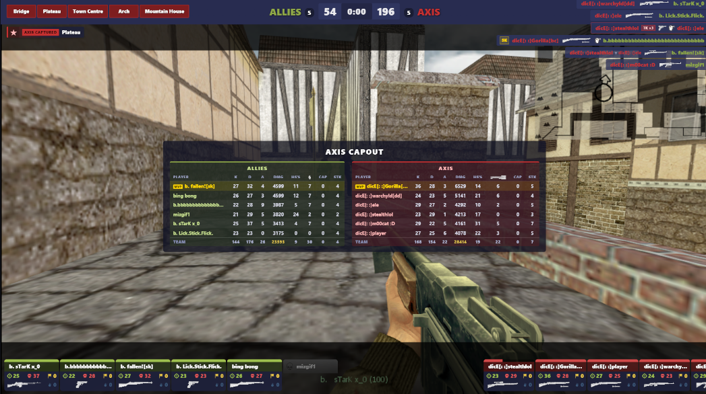

# KTP Competitive Infrastructure - Technical Guide

*A comprehensive ecosystem of custom engine modifications, extension modules, match management plugins, and supporting services designed for competitive 6v6 Day of Defeat gameplay.*

**No Metamod Required** - Runs on Linux and Windows via ReHLDS Extension Mode

**Last Updated:** 2026-07-20 (full refresh — versions, extension-mode lifecycle, HLTV 1.7.x architecture, monitoring stack)

**Doc home note:** This file (and `DEVELOPMENT_HISTORY.md`) used to live in `KTPMatchHandler/` for historical reasons — they predated the existence of `KTPInfrastructure/`. Moved to their proper home 2026-04-25.

**Refresh status (2026-07-20):**
- ✅ All version callouts refreshed against the deployed fleet (engine 3.22.0.929, KTPAMXX 2.7.24, ReAPI 5.29.0.365-ktp, AmxxCurl 1.3.15-ktp, plus all plugin + service versions)
- ✅ Layer 1/2 sections extended with the May-July 2026 work: async log writers, extension-mode lifecycle fixes, the `KTP_ExtensionShutdown` shutdown callback, profiling telemetry evolution
- ✅ KTPHLTVRecorder section rewritten for the 1.7.x cfg-driven always-on recording architecture (the 1.5.x record/stop model is retired)
- ✅ Monitoring section rewritten — Netdata retired fleet-wide 2026-07-02 in favor of in-house scripts (fleet-health heartbeat, perf rollup, crash reporter, telemetry aggregation)
- ⏳ Inline "(introduced in vX.Y)" markers in section prose are intentionally left as-is — those are historical attribution, not current-version claims.
- ⏳ Possible split into per-layer docs (ENGINE.md / SCRIPTING.md / MODULES.md / PLUGINS.md / SERVICES.md / ADMIN.md). Multi-session restructure; deferred.

[Architecture](#six-layer-architecture) | [Components](#component-documentation) | [Installation](#complete-installation-guide) | [Repositories](#github-repositories)

---

## Six-Layer Architecture

The KTP stack eliminates Metamod dependency through a custom extension loading architecture. KTPAMXX loads directly as a ReHLDS extension, and modules like KTP-ReAPI interface through KTPAMXX's module API instead of Metamod hooks.

```
┌─────────────────────────────────────────────────────────────────────────────┐
│  Layer 6: Application Plugins (AMX Plugins)                                 │
│  KTPMatchHandler v0.10.146 - Match workflow, pause, OT, score persistence,  │
│                              Discord, HLStatsX                              │
│  KTPHLTVRecorder v1.7.2   - HLTV health checks + demo-rename markers        │
│                             (recording itself is always-on, HLTV-cfg-driven)│
│  KTPCvarChecker v7.30     - Real-time cvar enforcement + Discord grouping   │
│  KTPFileChecker v2.7      - File consistency validation (audit-only)        │
│  KTPAdminAudit v2.7.17    - Menu-based kick/ban/changemap + timed bans      │
│  KTPPracticeMode v1.4.6   - Practice mode with .grenade, noclip, HUD        │
│  KTPGrenadeLoadout v1.0.9 - Custom grenade loadouts per class via INI       │
│  KTPGrenadeDamage v1.0.5  - Grenade damage reduction by configurable %      │
│  KTPScoreTracker v1.1.3   - Verbose capture scoring + per-cap Discord events│
│  KTPHudObserver v2.0.0    - Spectator HUD companion (community-contributed) │
│  stats_logging.sma        - DODX weaponstats (compiled from KTPAMXX source) │
│  admin.amxx               - AMXX admin-flag base (compiled from KTPAMXX src)│
│  All plugins: ktp_version_reporter — `rcon amx_ktp_versions` lists them all │
└─────────────────────────────────────────────────────────────────────────────┘
                              ↓ Uses AMXX Forwards & Natives
┌─────────────────────────────────────────────────────────────────────────────┐
│  Layer 5: Game Stats Modules (AMXX Modules)                                 │
│  DODX Module (in KTPAMXX 2.7.24) - DoD stats, weapons, shot tracking        │
│  Stats: dodx_flush_all_stats, dodx_reset_all_stats, dodx_set_match_id       │
│  Stats: dodx_set_stats_paused (round-freeze filtering for HLStatsX accuracy)│
│  Score persistence: dodx_get_observed_deaths, dodx_set_user_deaths,         │
│                     dodx_broadcast_scoreboard (mid-match DC/rejoin restore) │
│  Player: dodx_give_grenade, dodx_set_user_noclip, dodx_set_user_class/team  │
│  Forwards: dod_stats_flush, dod_damage_pre, dod_client_weapon_fire          │
│  Clock: dodx_get_round_time() — engine-authoritative half clock             │
└─────────────────────────────────────────────────────────────────────────────┘
                              ↓ Uses AMXX Module API
┌─────────────────────────────────────────────────────────────────────────────┐
│  Layer 4: HTTP/Networking Modules (AMXX Modules)                            │
│  KTP AMXX Curl v1.3.15-ktp - Non-blocking HTTP via libcurl + asio           │
│  Uses MF_RegModuleFrameFunc() for async processing                          │
│  2026: socket-lifecycle fix (keep-alive connection reuse), extension-mode   │
│        shutdown teardown, crash-safety guards at every C boundary           │
└─────────────────────────────────────────────────────────────────────────────┘
                              ↓ Uses AMXX Module API
┌─────────────────────────────────────────────────────────────────────────────┐
│  Layer 3: Engine Bridge Modules (AMXX Modules)                              │
│  KTP-ReAPI v5.29.0.365-ktp - Exposes ReHLDS/ReGameDLL hooks to plugins      │
│  Extension Mode: No Metamod, uses KTPAMXX GetEngineFuncs()                  │
│  Custom Hooks: RH_SV_UpdatePausedHUD (pause HUD), RH_SV_Rcon (RCON audit)   │
│  .365: Natives_Checks sentinel + checkable RegisterHookChain returns        │
└─────────────────────────────────────────────────────────────────────────────┘
                              ↓ Uses ReHLDS Hookchains
┌─────────────────────────────────────────────────────────────────────────────┐
│  Layer 2: Scripting Platform (ReHLDS Extension)                             │
│  KTPAMXX v2.7.24 - AMX Mod X fork with extension mode + HLStatsX integration│
│  Loads as ReHLDS extension, no Metamod required                             │
│  Provides: client_cvar_changed + client_infochanged forwards,               │
│            MF_RegModuleFrameFunc(), ktp_drop_client, ktp_discord.inc        │
│  2026 milestones:                                                           │
│  - JIT active fleet-wide (2026-04); async CLog writer (2.7.19)              │
│  - Extension-mode lifecycle fixes: per-map CLog::MapChange, hostname cvar   │
│    init, disconnect cleanup, changelevel-failure recovery (2.7.19-2.7.24)   │
│  - Refcounted SP forwards + CTask re-entry guard (2.7.22)                   │
│  - KTP_ExtensionShutdown export — orderly module detach at shutdown (2.7.22)│
└─────────────────────────────────────────────────────────────────────────────┘
                              ↓ ReHLDS Extension API
┌─────────────────────────────────────────────────────────────────────────────┐
│  Layer 1: Game Engine (KTP-ReHLDS v3.22.0.929)                              │
│  Custom ReHLDS fork with extension loader + KTP features                    │
│  Provides: SV_UpdatePausedHUD hook, SV_Rcon hook, pfnClientCvarChanged,     │
│            SV_ClientUserInfoChanged (re-enabled .929, ktp_userinfo_hook)    │
│  Features: ktp_silent_pause cvar, frame profiler, async log writer          │
│  Blocked: kick, banid, removeid, addip, removeip (use .kick/.ban instead)   │
│  Profiler: 6-phase frame timing, physics sub-phases, I/O sink timing,       │
│            spike alerts ([KTP_SPIKE], [KTP_SPIKE_PHYS], [KTP_SPIKE_IO])     │
│  2026 milestones:                                                           │
│  - .925/.926: hitreg-audit instrumentation (entity + I/O sink attribution)  │
│  - .927: async log-file writer (ktp_log_async) — game thread never blocks   │
│          on the log disk again                                              │
│  - .928: KTP_ExtensionShutdown callback, ktp_extension_loaded sentinel,     │
│          RH_SV_Rcon fires on every attempt (incl. failures)                 │
│  - .929: SV_ClientUserInfoChanged hookchain re-enabled (ktp_userinfo_hook)  │
└─────────────────────────────────────────────────────────────────────────────┘

                         Supporting Infrastructure:
┌─────────────────────────────────────────────────────────────────────────────┐
│  Cloud Services:                                                            │
│  - Discord Relay v1.1.1     - HTTP proxy for Discord API (Cloud Run)        │
│                                                                             │
│  Data Server (<DATA_SERVER_IP>):                                            │
│  - KTPHLStatsX v0.3.3       - HLStatsX daemon with per-half stats + batching│
│  - KTPFileDistributor v1.1.3 - .NET 8 file sync daemon (SFTP distribution)  │
│  - HLTV proxies (24)        - always-on recording + post-match demo renamer │
│  - Fleet Drift Audit        - Weekly cron, 5-category state-diff alerts     │
│  - Fleet-Health Heartbeat   - 1-min cron on each game host                  │
│  - Admin tier               - See "Admin Infrastructure" section below      │
│                                                                             │
│  SDK Layer:                                                                 │
│  - KTP HLSDK v1.0.0         - pfnClientCvarChanged callback headers         │
└─────────────────────────────────────────────────────────────────────────────┘
```

### Key Innovation: No Metamod Required

| Traditional Stack                                | KTP Stack                                        |
|--------------------------------------------------|--------------------------------------------------|
| ReHLDS → Metamod → AMX Mod X → ReAPI → Plugins   | KTP-ReHLDS → KTPAMXX → KTP-ReAPI → Plugins       |
| Metamod loads AMX Mod X as plugin                | KTPAMXX loads as ReHLDS extension directly       |
| ReAPI uses Metamod hooks                         | KTP-ReAPI uses ReHLDS hookchains via KTPAMXX     |
| DODX requires Metamod for PreThink               | DODX uses SV_PlayerRunPreThink hookchain         |
| Linux requires Metamod                           | **Linux works natively**                         |

> **Why no Metamod?** Wall penetration breaks under ReHLDS + Metamod regardless of version. The discovery + debug analysis + decision record lives in [`DEVELOPMENT_HISTORY.md` → Architecture Decision Records → ADR-001](DEVELOPMENT_HISTORY.md#adr-001-eliminate-metamod-extension-mode). This file documents the resulting architecture; the ADR documents why we got here.

<details>
<summary><b>Extension Mode: How It Replaces Metamod</b></summary>

#### The Problem Metamod Solves

Metamod exists because the GoldSrc engine has a single "game DLL" slot. Without Metamod:
- Engine loads ONE game DLL (e.g., `dod.dll`)
- No way to inject additional code
- No hooks, no plugins, no AMX Mod X

Metamod intercepts this by pretending to be the game DLL, then loading the real game DLL plus plugins.

#### What KTP Extension Mode Does Instead

KTP-ReHLDS adds an **extension loading system** that runs parallel to the game DLL:

```
┌─────────────────────────────────────────────────────────────────────────────┐
│                         KTP-ReHLDS Engine                                    │
│                                                                              │
│  ┌─────────────────┐    ┌─────────────────┐    ┌─────────────────┐          │
│  │  Game DLL Slot  │    │ Extension Slot 1│    │ Extension Slot 2│   ...    │
│  │    (dod.dll)    │    │   (ktpamx.dll)  │    │  (future use)   │          │
│  └────────┬────────┘    └────────┬────────┘    └─────────────────┘          │
│           │                      │                                           │
│           │    ┌─────────────────┴─────────────────┐                        │
│           │    │       ReHLDS Hookchain API        │                        │
│           │    │  (SV_ClientCommand, AlertMessage, │                        │
│           │    │   SV_DropClient, TraceLine, etc.) │                        │
│           │    └───────────────────────────────────┘                        │
│           │                      │                                           │
│           ▼                      ▼                                           │
│  ┌─────────────────────────────────────────────────────────────────┐        │
│  │                    Engine Core (sv_main.cpp)                     │        │
│  │  - Calls hookchains at key points                                │        │
│  │  - Extensions can intercept/modify behavior                      │        │
│  │  - Game DLL runs normally, unaware of extensions                 │        │
│  └─────────────────────────────────────────────────────────────────┘        │
└─────────────────────────────────────────────────────────────────────────────┘
```

#### Extension Loading Sequence

**1. Engine Startup (`Sys_InitGame`)**
```cpp
// KTP-ReHLDS loads extensions from <gamedir>/addons/extensions.ini
void LoadExtensions() {
    // Parse extensions.ini
    // For each extension DLL:
    LoadLibrary("ktpamx.dll");

    // Call extension entry point
    AMXX_RehldsExtensionInit();
}
```

**2. Extension Initialization**
```cpp
// In KTPAMXX's extension entry point
extern "C" DLLEXPORT void AMXX_RehldsExtensionInit() {
    // Get ReHLDS API
    g_RehldsApi = GetRehldsApi();
    g_RehldsFuncs = g_RehldsApi->GetFuncs();
    g_RehldsHookchains = g_RehldsApi->GetHookchains();

    // Register for engine events via hookchains
    g_RehldsHookchains->SV_DropClient()->registerHook(&OnClientDisconnect);
    g_RehldsHookchains->SV_ClientCommand()->registerHook(&OnClientCommand);
    g_RehldsHookchains->SV_ActivateServer()->registerHook(&OnServerActivate);
    // ... etc

    // Store engine pointers for module use
    g_pEngineFuncs = g_RehldsFuncs->GetEngineFuncs();
    g_pGlobalVars = g_RehldsFuncs->GetGlobalVars();
}
```

**3. Game DLL Loads Normally**
```cpp
// Engine loads dod.dll via standard GiveFnptrsToDll
// DoD receives ORIGINAL engine functions
// No Metamod wrapper in the chain
// Wall penetration works correctly
```

#### What Extensions Can Do (That Metamod Did)

| Metamod Capability | Extension Mode Equivalent |
|-------------------|---------------------------|
| Hook engine functions | ReHLDS hookchains |
| Hook game DLL functions | ReHLDS hookchains (limited) |
| Load plugins | KTPAMXX module system |
| Intercept messages | `PF_RegUserMsg_I` hookchain |
| Modify client commands | `SV_ClientCommand` hookchain |
| Track connections | `ClientConnected` hookchain |

#### Linux Support: Why Extension Mode Matters

**The Linux Problem:**
- Linux game servers need plugins for competitive play
- AMX Mod X on Linux traditionally requires Metamod
- Metamod + ReHLDS + DoD = broken wall penetration
- **Result:** No viable Linux competitive servers

**The Extension Mode Solution:**
- KTPAMXX loads as ReHLDS extension (no Metamod)
- ReHLDS provides all necessary hookchains
- DoD loads directly (no wrapper DLL)
- **Result:** Full Linux support with working gameplay

```bash
# Linux server setup (extension mode)
rehlds/
├── hlds_linux
├── engine_i486.so          # KTP-ReHLDS engine
├── dod/
│   ├── dlls/
│   │   └── dod.so          # Original game DLL (no wrapper!)
│   └── addons/
│       └── ktpamx/
│           ├── dlls/
│           │   └── ktpamx_i386.so   # Loaded as extension
│           └── modules/
│               ├── reapi_ktp_i386.so
│               └── dodx_ktp_i386.so
└── rehlds/
    └── extensions.ini      # Lists ktpamx_i386.so
```

</details>

---

## Component Documentation

### Layer 1: KTP-ReHLDS (Engine)

**Repository:** [github.com/afraznein/KTPReHLDS](https://github.com/afraznein/KTPReHLDS)
**Version:** 3.22.0.929
**License:** MIT

> **Version identity note:** the console banner is generated from the git commit count (`appversion.h`) and drifts from the CHANGELOG version by design. Deployments are verified by binary checksum, not by banner.

<details>
<summary><b>Core Engine Features</b></summary>

#### Extension Loading System

KTP-ReHLDS provides the foundation for loading KTPAMXX without Metamod:

```cpp
// ReHLDS extension entry point (used by KTPAMXX)
extern "C" DLLEXPORT void AMXX_RehldsExtensionInit();
extern "C" DLLEXPORT void AMXX_RehldsExtensionShutdown();
```

**What This Enables:**
- KTPAMXX loads directly into ReHLDS process
- Full access to ReHLDS hookchains and APIs
- Cross-platform operation (Windows + Linux)
- No Metamod DLL required

#### Selective Pause System

Standard GoldSrc pause freezes everything. KTP-ReHLDS provides selective freeze:

| What Gets Frozen                     | What Keeps Working                 |
|--------------------------------------|------------------------------------|
| Physics (`SV_Physics()` skipped)     | Network I/O                        |
| Game time (`g_psv.time` frozen)      | HUD messages                       |
| Player movement                      | Server messages (`rcon say`)       |
| Entity thinking                      | Commands (`/pause`, `/resume`)     |
| Projectiles                          | Client message buffers             |

#### Silent Pause Mode (v3.22.0+)

New cvar `ktp_silent_pause` controls client pause overlay:

| Value | Behavior |
|-------|----------|
| `0` (default) | Normal - clients receive `svc_setpause`, see "PAUSED" overlay |
| `1` | Silent - clients don't receive `svc_setpause`, custom HUD only |

**Use Case:** KTPMatchHandler sets `ktp_silent_pause 1` before pausing, enabling custom MM:SS countdown HUD without the blocky client overlay.

```cpp
// KTP-ReHLDS broadcasts pause state respecting cvar
void SV_BroadcastPauseState(qboolean paused) {
    if (ktp_silent_pause.value != 0.0f) {
        return;  // Skip broadcast - clients won't see overlay
    }
    // Normal broadcast to all connected clients
}
```

#### Frame Profiling System (v3.22.0.904+)

Low-overhead profiling built into the engine for diagnosing performance issues on live production servers.

**CVars:**

| Cvar | Default | Description |
|------|---------|-------------|
| `ktp_profile_frame` | `0` | Enable/disable frame profiling |
| `ktp_profile_interval` | `10` | Seconds between summary logs |
| `ktp_profile_spike_threshold` | `5.0` | Log `[KTP_SPIKE]` alert when any frame exceeds this ms (0 = disabled) |
| `ktp_profile_steam_detail` | `0` | Granular Steam_RunFrame() sub-timing |

**6-Phase Frame Timing:**

Each `SV_Frame_Internal()` call is broken into six phases:

| Phase | Function | What It Measures |
|-------|----------|-----------------|
| `read` | `SV_ReadPackets` | Network input, packet parsing |
| `phys` | `SV_Physics` | Game simulation, plugin hooks |
| `misc1` | `SV_RequestMissing` + `SV_CheckTimeouts` | Resource requests, timeout checks |
| `send` | `SV_SendClientMessages` | Network output to clients |
| `post` | Pause restore + `SV_GatherStatistics` | Post-frame housekeeping |
| `steam` | `Steam_RunFrame` | Steam callbacks, packet send |

**v3.22.0.912 additions:**
- Physics sub-phase timing — separates `pfnStartFrame` (AMXX plugins + game DLL) from entity physics loop
- Per-client send timing — identifies the worst (slowest) client each frame
- Profiler overhead optimization — eliminated 10,000+ cache-dirtying writes/sec on production by gating globals behind profiling flag, consolidated cvar dereferences into single `g_ktp_profiling_enabled` global

**Later evolution (v3.22.0.917 → .929):**
- `[KTP_SPIKE_PHYS]` (v917) — fires *on* a physics spike frame with per-frame sub-phase times (`startframe`, `entloop`, pause-path phases), instead of relying on a periodic sample that's stale by spike time
- `[KTP_SPIKE_IO]` (v926) — attributes I/O time on spike frames per sink: the UDP logaddress send (`logaddr=`) vs the log-file disk write (`file=`). This split is what proved the log *disk write* was the blocking sink behind the fleet's 50-165ms frame stalls (see the async log writer below)
- `[KTP_PROFILE] io:` interval line — worst-case per-sink I/O timing per interval, plus async-writer health fields (`fileq_worst=`, `logq_drops=`, `ctl_drops=`, `writer_alive=`)
- `phys_detail` → `phys_detail_peak` (v929) — the periodic physics detail line now reports interval *peaks* rather than the last frame's instantaneous values, so it's useful for spike attribution
- Per-frame `getrusage` snapshot gated on `ktp_profile_spike_threshold > 0` (v929) — removes the one real syscall from the profiling hot path when spike alerts are off

**Summary log output (every N seconds):**
```
[KTP_PROFILE] frames=9823 fps=982.3 edicts_max=156
[KTP_PROFILE] avg: read=0.120ms phys=0.450ms misc1=0.005ms send=0.080ms post=0.003ms steam=0.010ms full=0.680ms
[KTP_PROFILE] peak: read=0.450ms phys=1.200ms misc1=0.020ms send=0.300ms post=0.010ms steam=0.050ms full=2.100ms
[KTP_PROFILE] phys_detail_peak: startframe=0.350ms entloop=0.100ms
[KTP_PROFILE] send_detail: worst_client=5(PlayerName) time=0.280ms clients_sent=12
```

**Spike alert output (immediate, rate-limited to 1/sec):**
```
[KTP_SPIKE] full=12.340ms read=0.150ms phys=0.500ms misc1=0.010ms send=0.100ms post=0.005ms steam=11.500ms gap=0.075ms
```

#### Async Log-File Writer (v3.22.0.927+)

The 2026 hit-registration audit traced the fleet's worst remaining frame-stall class (50-167ms freezes, including during prime-time matches) to `Log_Printf`'s synchronous log-file append: ext4 journal commits on consumer SSDs could block the game thread for over 100ms per write. The UDP logaddress sink measured harmless everywhere; the disk write was the problem.

v927 moves the log file onto a dedicated writer thread:

| Aspect | Behavior |
|--------|----------|
| `ktp_log_async` cvar | Default `1`. `0` restores the exact synchronous legacy path. Latches per log session at `Log_Open` |
| Game thread | Enqueues formatted lines into a fixed 2048-slot ring (microseconds; never blocks) |
| Writer thread | Owns the log `FILE*` via plain stdio, line-buffered for crash durability |
| Full queue | Drops the line and counts it (`logq_drops=`) — never blocks the frame |
| Open/close | Queued as control ops so ordering across map-change rotations is preserved; v928 adds a bounded wait so a dropped OPEN can't silently lose a whole map's log file (`ctl_drops=` counter, expected 0 forever) |
| Health | `writer_alive=` heartbeat on the `io:` profile line |

Log file content and line ordering are identical in both modes. KTPAMXX gained the same treatment for its own log paths in 2.7.19 (`amxx_log_async`), which together with v927 eliminated the 100ms+ game-thread stall class outright — fleet spike telemetry shows the class *ceased* the night the pair activated, not shrank.

#### Extension Shutdown Callback (v3.22.0.928+)

In extension mode, nothing used to call module detach at full server shutdown: `Meta_Detach` is Metamod-only, and the engine's `ReleaseEntityDlls()` only calls the single `pfnGameShutdown` slot before dlclosing everything. Modules dlopened inside KTPAMXX (dodx, reapi, amxxcurl) got no teardown until exit-time static destructors ran — after KTPAMXX's `MF_*` function surface was already unmapped. That ordering was the root cause of a recurring shutdown segfault class (see DEVELOPMENT_HISTORY, July 2026).

v928 closes the gap structurally:
- `ReleaseEntityDlls()` dlsym's each extension DLL for an optional `KTP_ExtensionShutdown` export and calls it *before* the dlclose loop, while every library is still mapped. An absent export is a silent no-op, so the change is fully forward-compatible.
- KTPAMXX 2.7.22+ exports it and runs the full module-detach cascade — so `OnAmxxDetach` now genuinely runs at every shutdown, fleet-wide.

v928 also adds the **`ktp_extension_loaded` sentinel cvar** — a count of extension DLLs successfully loaded from `extensions.ini`. A missing or misplaced `extensions.ini` previously degraded the server to vanilla HLDS (no wall-penetration fix, no cvar enforcement, no match handler) with only a single console line to show for it; deploy and restart scripts now assert `ktp_extension_loaded >= 1` over rcon after every start.

#### RCON Audit Completeness (v3.22.0.928+)

The `RH_SV_Rcon` hookchain originally fired only on successful rcon commands. v928 makes it fire on **every** attempt with the real validity flag, so failed attempts (bad password, banned, no privilege) reach KTPAdminAudit and Discord too. The audited string never includes the password, failure audits are rate-limited, and failure audits fire before the packet redirect window so a handler's console output can't leak into the reply sent to an unauthenticated prober.

#### SV_ClientUserInfoChanged Re-enable (v3.22.0.929)

The `SV_ClientUserInfoChanged` hookchain call site had been disabled since December 2025 — it was added already commented out, so in extension mode the game DLL was called directly and KTPAMXX's `client_infochanged` forward never fired. Practical effect: `get_user_name()` returned the connect-time name for the life of a session, which was the root cause of every "stale name after a rename" report (kick menus, ready/confirm text, Discord embeds).

v929 re-enables the hookchain behind `ktp_userinfo_hook` (default `1`), implemented as an if/else so each name change dispatches to the game DLL exactly once on either branch. The cvar is read per userinfo update — `ktp_userinfo_hook 0` is a live rollback with no map change or binary swap.

#### Lag Compensation Configuration

The fleet runs `sv_unlagsamples 1` (the engine default) since 2026-06-11. Higher values look attractive on paper but rest on a wrong premise: the client frame buffer advances per *client packet* (~100/s), not per server frame, so 20 samples meant ~200ms of latency smoothing and a jitter-guard window in which a single ping spike silently disabled lag compensation for subsequent shots. Engine telemetry added in v925 validated the change (`guard_zero=0` fleet-wide) before the instrumentation was retired in v926.

#### Extension Mode Hookchains (v3.16.0-3.22.0)

| Hook                       | Purpose                              | Used By              |
|----------------------------|--------------------------------------|----------------------|
| `SV_ClientCommand`         | Chat commands, menus                 | `register_clcmd`     |
| `SV_InactivateClients`     | Map change cleanup                   | `plugin_end`         |
| `SV_ClientUserInfoChanged` | Client info changes (re-enabled v929, `ktp_userinfo_hook`) | `client_infochanged` |
| `PF_RegUserMsg_I`          | Message ID capture                   | HUD drawing          |
| `PF_changelevel_I`         | Level change                         | `server_changelevel` |
| `AlertMessage`             | Engine log messages                  | `register_logevent`  |
| `PF_TraceLine`             | TraceLine interception               | DODX `TraceLine`     |
| `PF_SetClientKeyValue`     | Client key/value changes             | DODX stats           |
| `SV_PlayerRunPreThink`     | Player PreThink loop                 | DODX shot tracking   |
| `SV_Rcon` (v3.20.0+)       | RCON command interception            | KTPAdminAudit        |
| `Host_Changelevel_f` (v3.20.0+) | Console changelevel command     | KTPMatchHandler OT   |

#### Custom Hook: `SV_UpdatePausedHUD`

Called every frame (~60-100 Hz) during pause:

```cpp
// In KTP-ReHLDS sv_main.cpp
void SV_Frame() {
    if (g_psv.paused) {
        // Call pause HUD hook for plugins to update displays
        g_RehldsHookchains.m_SV_UpdatePausedHUD->callChain();
    }
}
```

**Enables:**
- Real-time MM:SS countdown during pause
- Warning messages (30s, 10s remaining)
- Unpause countdown (5...4...3...2...1)
- Server announcements during pause

</details>

---

### KTP HLSDK (SDK Layer)

**Repository:** [github.com/afraznein/KTPhlsdk](https://github.com/afraznein/KTPhlsdk)
**Version:** 1.0.0
**License:** Valve Half-Life 1 SDK License (non-commercial)
**Base:** Half-Life 1 SDK by Valve

<details>
<summary><b>pfnClientCvarChanged Callback</b></summary>

#### The Missing Callback

Standard Half-Life SDK does not expose client cvar query responses to game DLLs or plugins. When a server queries a client's cvar value, the response arrives at the engine but there's no standard way to notify plugins.

**The KTP HLSDK Solution:**

Added `pfnClientCvarChanged` callback to `NEW_DLL_FUNCTIONS` structure:

```cpp
// engine/eiface.h - KTP modification
typedef struct
{
    // ... existing functions ...

    // KTP Addition: Client cvar change callback
    void (*pfnClientCvarChanged)(const edict_t *pEdict, const char *cvar, const char *value);

} NEW_DLL_FUNCTIONS;
```

#### Data Flow

```
┌─────────────────────────────────────┐
│  Game Client                        │
│  - Server queries cvar              │
│  - Client responds with value       │
└────────────────┬────────────────────┘
                 │ Network packet
                 ↓
┌─────────────────────────────────────┐
│  KTP-ReHLDS (Modified Engine)       │
│  - Uses NEW_DLL_FUNCTIONS           │
│  - Calls pfnClientCvarChanged       │
└────────────────┬────────────────────┘
                 │ Callback
                 ↓
┌─────────────────────────────────────┐
│  KTPAMXX (Extension Mode)           │
│  - Receives callback                │
│  - Fires client_cvar_changed forward│
└────────────────┬────────────────────┘
                 │ Forward
                 ↓
┌─────────────────────────────────────┐
│  AMX Plugin (KTPCvarChecker)        │
│  - Validates cvar value             │
│  - Enforces correct value           │
└─────────────────────────────────────┘
```

#### Why This Matters

**Without this callback:**
- Cvar detection relies on periodic polling
- Players can change cvars between queries
- Detection delays of 15-90 seconds possible
- Sophisticated cheats can evade detection

**With pfnClientCvarChanged:**
- Real-time notification when client responds
- Sub-second detection (typically <2 seconds)
- No polling gaps to exploit
- Zero performance impact (callback-driven)

#### Engine Implementation

```cpp
// In KTP-ReHLDS, when client responds to cvar query:
void SV_ParseCvarValue(client_t *cl, sizebuf_t *msg) {
    const char* cvarName = MSG_ReadString(msg);
    const char* cvarValue = MSG_ReadString(msg);

    // KTP: Notify game DLL via callback
    if (gNewDLLFunctions.pfnClientCvarChanged) {
        edict_t* pEdict = EDICT_NUM(cl->id + 1);
        gNewDLLFunctions.pfnClientCvarChanged(pEdict, cvarName, cvarValue);
    }
}
```

#### Compatibility

| Component | Status | Notes |
|-----------|--------|-------|
| Standard HLDS | ❌ | Callback not called |
| ReHLDS (stock) | ❌ | Callback not called |
| KTP-ReHLDS | ✅ | Full support |
| Existing mods | ✅ | Callback is optional, backwards compatible |

</details>

---

### Layer 2: KTPAMXX (Scripting Platform)

**Repository:** [github.com/afraznein/KTPAMXX](https://github.com/afraznein/KTPAMXX)
**Version:** 2.7.24
**License:** GPL v3
**Base:** AMX Mod X 1.10.0.5468-dev

> **Version identity note:** the console banner stamps `<version>.<build-number>`, and the build number includes a per-minute build timestamp — any rebuild changes it. Deployments are verified by binary checksum, not by banner.

<details>
<summary><b>Extension Mode Architecture</b></summary>

#### Dual-Mode Operation

KTPAMXX automatically detects environment and adapts:

```cpp
// Global flags set during initialization
bool g_bRunningWithMetamod;      // True if Metamod present
bool g_bRehldsExtensionInit;     // True if loaded as extension

// Entry points
void Meta_Attach();              // Traditional Metamod mode
void AMXX_RehldsExtensionInit(); // Extension mode (no Metamod)
```

#### ReHLDS Hooks (Extension Mode)

| Hook                                   | Purpose                      |
|----------------------------------------|------------------------------|
| `SV_DropClient`                        | Client disconnect handling   |
| `SV_ActivateServer`                    | Map load / server activation |
| `Cvar_DirectSet`                       | Cvar change monitoring       |
| `SV_WriteFullClientUpdate`             | Client info updates          |
| `ED_Alloc` / `ED_Free`                 | Entity allocation            |
| `SV_StartSound`                        | Sound emission               |
| `ClientConnected` / `SV_ConnectClient` | Connection handling          |
| `SV_ClientCommand`                     | Chat commands, menus         |
| `SV_InactivateClients`                 | Map change plugin_end        |
| `AlertMessage`                         | Log events (logevent)        |

</details>

<details>
<summary><b>Extension-Mode Lifecycle: What Metamod Used to Do For Free</b></summary>

A recurring bug class through 2026 came from one structural fact: large parts of stock AMX Mod X's init and teardown only exist on the Metamod path. `C_Spawn`, `C_ServerDeactivate_Post`, `Meta_Detach`, and the DLL-table wrappers never run in extension mode, so any state they own is never reset and any forward they fire never arrives — unless the extension-mode path re-implements it. Most of the 2.7.16-2.7.24 release arc is exactly that re-implementation, each item found the hard way:

| Fact | Consequence | Fix |
|------|-------------|-----|
| Globals persist across map changes (no plugin reload) | Any "once per map" state must be reset explicitly; several counters silently accumulated forever | Per-case resets (2.7.16-2.7.24): `CLog::MapChange()` per map (2.7.19), DODX per-map/per-slot state resets (2.7.20/2.7.24), changelevel-failure latch recovery (2.7.24) |
| `C_Spawn` never runs | The `hostname` cvar pointer was never cached — NULL for the whole process; one out-of-range `get_user_name()` call away from a game-thread crash (hit in production 2026-07-10) | 2.7.22 caches it in the extension-mode init block + NULL guards at all deref sites |
| `Meta_Detach` never runs | No module ever got detach at shutdown; module static destructors ran *after* KTPAMXX's `MF_*` surface was unmapped — a recurring shutdown segfault class | 2.7.22 exports `KTP_ExtensionShutdown`; ReHLDS .928 calls it before the dlclose loop; the detach cascade now runs on every shutdown |
| Client disconnect wrappers never run | DODX disconnect cleanup was skipped — slot reuse inherited the previous occupant's state | 2.7.24 wires cleanup through the extension-mode disconnect hook |
| `client_infochanged` ordering | The forward fired after the name cache was already refreshed, defeating the stock old-name/new-name comparison idiom | 2.7.24 fires the forward before the name assignment (paired with the ReHLDS .929 hookchain re-enable) |

The shared lesson: in extension mode, every lifecycle assumption inherited from upstream AMX Mod X has to be re-verified, because the code that honored it may simply never execute.

**Async CLog writer (2.7.19).** `log_amx` / `LogError` used to fopen/fprintf/fclose per line on the game thread — the same disk-stall class the engine fixed in ReHLDS .927, and the actual mechanism behind the fleet's 100ms+ frame-stall telemetry (log writes blocking on ext4 journal commits). 2.7.19 moves AMXX log writes onto an async writer, gated by the `amxx_log_async` localinfo key (default on).

**Forward/task correctness (2.7.20/2.7.22).** Two long-lived platform bugs fell in this arc. `CTask` double-decremented its active-task counter when a repeating task removed itself, eventually stalling *all* `set_task` timers (the cause of intermittently missing ready/confirm HUD updates). And the SP-forward dedup handed out shared handles with no reference counting — a dying holder freed the slot, the free list recycled the id, and surviving timers executed the wrong callback. 2.7.22 makes SP forwards refcounted and adds a CTask re-entry guard.

</details>

<details>
<summary><b>New Forward: client_cvar_changed</b></summary>

#### Real-Time Cvar Monitoring

```pawn
/**
 * Called when a client responds to ANY cvar query.
 * Requires KTP-ReHLDS for full functionality.
 *
 * @param id        Client index (1-32)
 * @param cvar      Name of the queried cvar
 * @param value     Value returned by client (string)
 */
forward client_cvar_changed(id, const cvar[], const value[]);
```

</details>

<details>
<summary><b>Module API Extensions (v2.4.0+)</b></summary>

#### The Module API Problem

In traditional AMX Mod X with Metamod:
- Modules use Metamod's `gpGlobals` and `g_engfuncs` directly
- Metamod provides these via its DLL interface
- Modules call `GET_HOOK_TABLES()` during `Meta_Query()`

In extension mode, there's no Metamod. KTPAMXX must provide these APIs itself.

#### New Module API Functions

```cpp
// amxxmodule.h - New exports for extension mode

// Get engine function table (replaces Metamod's g_engfuncs)
enginefuncs_t* MF_GetEngineFuncs();

// Get global variables (replaces Metamod's gpGlobals)
globalvars_t* MF_GetGlobalVars();

// Get user message ID by name (extension mode message tracking)
int MF_GetUserMsgId(const char* name);

// Register module message handler (for HUD messages, etc.)
void MF_RegModuleMsgHandler(int msgId, pfnMsgHandler handler);

// Register per-frame callback (replaces Metamod's StartFrame hook)
void MF_RegModuleFrameFunc(void (*callback)());

// Get ReHLDS API pointer (for modules needing hookchain access)
IRehldsApi* MF_GetRehldsApi();
```

#### How Modules Use It

```cpp
// In module's AMXX_Attach() or OnPluginsLoaded()
void OnAmxxAttach() {
    // Get engine access (would normally come from Metamod)
    g_engfuncs = MF_GetEngineFuncs();
    gpGlobals = MF_GetGlobalVars();

    if (!g_engfuncs || !gpGlobals) {
        MF_Log("ERROR: Engine functions not available");
        return;
    }

    // Now module can call engine functions
    g_engfuncs->pfnServerPrint("Module loaded!\n");
}
```

#### Module Compatibility Matrix

| Module | Extension Mode | Notes |
|--------|---------------|-------|
| **KTP-ReAPI** | ✅ Full | Uses `MF_GetEngineFuncs()`, registers ReHLDS hooks |
| **KTP AMXX Curl** | ✅ Full | Uses `MF_RegModuleFrameFunc()` for async |
| **DODX** | ✅ Full | Uses `MF_GetEngineFuncs()` + PreThink hookchain |
| **DODFun** | N/A | Not loaded — natives ported to DODX |
| **SQLite** | ❌ Broken | Has Metamod-specific code paths |
| **MySQL** | ⚠️ Untested | May work, not verified |

</details>

<details>
<summary><b>KTP-Specific Natives (v2.6.0)</b></summary>

#### ktp_drop_client Native

Drops a client via ReHLDS API, bypassing blocked kick command:

```pawn
/**
 * Drop a client from the server via ReHLDS DropClient API.
 * Works even when kick console command is blocked at engine level.
 *
 * @param id        Client index (1-32)
 * @param reason    Disconnect reason shown to client (optional)
 * @return          1 on success, 0 if client not connected
 */
native ktp_drop_client(id, const reason[] = "");
```

**Implementation in KTPAMXX:**
```cpp
// In ktp_natives.cpp
static cell AMX_NATIVE_CALL ktp_drop_client(AMX *amx, cell *params) {
    int client = params[1];

    if (!MF_IsPlayerIngame(client))
        return 0;

    char reason[128];
    MF_GetAmxString(amx, params[2], 0, reason, sizeof(reason));

    // Call ReHLDS DropClient directly
    IGameClient* pClient = g_RehldsApi->GetClientByIndex(client - 1);
    if (pClient) {
        g_RehldsFuncs->DropClient(pClient, false, reason);
        return 1;
    }

    return 0;
}
```

**Why This Native Exists:**

KTP-ReHLDS blocks `kick`, `banid`, and related commands to prevent untraceable RCON kicks.
This native provides an audited alternative that:
1. Can only be called from plugins (not RCON)
2. Plugins can log who initiated the kick
3. Works with KTPAdminAudit for full accountability

</details>

<details>
<summary><b>ktp_discord.inc - Shared Discord Integration</b></summary>

#### Purpose

Multiple KTP plugins need Discord integration:
- KTPMatchHandler (match notifications)
- KTPAdminAudit (kick/ban logging)
- KTPCvarChecker (violation alerts)
- KTPFileChecker (file inconsistencies)

Instead of each plugin loading its own config, `ktp_discord.inc` provides shared functionality.

#### Include File

```pawn
// ktp_discord.inc - Shared Discord integration for KTP plugins

// Color constants for embed messages
#define KTP_DISCORD_COLOR_GREEN   0x00FF00
#define KTP_DISCORD_COLOR_RED     0xFF0000
#define KTP_DISCORD_COLOR_ORANGE  0xFF8C00
#define KTP_DISCORD_COLOR_BLUE    0x0080FF

/**
 * Load Discord configuration from discord.ini
 * Call this in plugin_cfg()
 */
stock ktp_discord_load_config();

/**
 * Check if Discord integration is enabled
 * @return true if relay URL and auth are configured
 */
stock bool:ktp_discord_is_enabled();

/**
 * Send an embed message to all audit channels
 * Audit channels: discord_channel_id_audit*, discord_channel_id_admin
 *
 * @param title         Embed title
 * @param description   Embed body (supports ^n for newlines)
 * @param color         Embed color (use KTP_DISCORD_COLOR_* constants)
 */
stock ktp_discord_send_embed_audit(const title[], const description[], color);

/**
 * Send an embed message to a specific channel
 *
 * @param channel_id    Discord channel ID
 * @param title         Embed title
 * @param description   Embed body
 * @param color         Embed color
 */
stock ktp_discord_send_embed(const channel_id[], const title[], const description[], color);

/**
 * Get a specific channel ID from config
 *
 * @param key           Config key (e.g., "discord_channel_id_competitive")
 * @param output        Buffer for channel ID
 * @param maxlen        Buffer size
 * @return              true if found
 */
stock bool:ktp_discord_get_channel(const key[], output[], maxlen);
```

#### Configuration File (`discord.ini`)

```ini
; Discord Relay Configuration
; Path: <configsdir>/discord.ini

; Required: Relay server URL and authentication
discord_relay_url=https://your-relay.run.app/reply
discord_auth_secret=your-shared-secret-here

; Default channel for general notifications
discord_channel_id=1234567890123456789

; Match-type specific channels (for KTPMatchHandler)
discord_channel_id_competitive=1111111111111111111
discord_channel_id_scrim=2222222222222222222
discord_channel_id_12man=3333333333333333333
discord_channel_id_draft=4444444444444444444

; Audit channels (for KTPAdminAudit, KTPCvarChecker, KTPFileChecker)
; All channels matching "discord_channel_id_audit*" receive audit messages
discord_channel_id_audit_main=5555555555555555555
discord_channel_id_audit_backup=6666666666666666666
discord_channel_id_admin=7777777777777777777
```

#### Usage Example

```pawn
#include <amxmodx>
#include <ktp_discord>

public plugin_cfg() {
    ktp_discord_load_config();
}

public OnPlayerViolation(id, const cvar[], const value[]) {
    if (!ktp_discord_is_enabled())
        return;

    new name[32], steamid[35];
    get_user_name(id, name, charsmax(name));
    get_user_authid(id, steamid, charsmax(steamid));

    new description[256];
    formatex(description, charsmax(description),
        "**Player:** %s^n**SteamID:** %s^n**Cvar:** %s^n**Value:** %s",
        name, steamid, cvar, value);

    ktp_discord_send_embed_audit("Cvar Violation", description, KTP_DISCORD_COLOR_RED);
}
```

#### HTTP Request Format

The include sends requests to the Discord relay:

```json
{
    "channel_id": "1234567890123456789",
    "embeds": [{
        "title": "Cvar Violation",
        "description": "**Player:** Cheater\n**SteamID:** STEAM_0:1:12345\n**Cvar:** r_fullbright\n**Value:** 1",
        "color": 16711680
    }],
    "auth_secret": "your-shared-secret-here"
}
```

</details>

<details>
<summary><b>Path and Naming Changes</b></summary>

#### KTP Branding

| Component         | Standard AMX Mod X         | KTPAMXX                           |
|-------------------|----------------------------|-----------------------------------|
| Main binary       | `amxmodx_mm.dll/.so`       | `ktpamx.dll` / `ktpamx_i386.so`   |
| Module suffix     | `*_amxx.dll/.so`           | `*_ktp.dll` / `*_ktp_i386.so`     |
| Configs directory | `addons/amxmodx/`          | `addons/ktpamx/`                  |
| Plugins directory | `addons/amxmodx/plugins/`  | `addons/ktpamx/plugins/`          |

#### Directory Structure

```
addons/ktpamx/
├── dlls/
│   └── ktpamx.dll (or ktpamx_i386.so)
├── configs/
│   ├── amxx.cfg
│   ├── plugins.ini
│   ├── modules.ini
│   ├── users.ini
│   ├── ktp_maps.ini
│   ├── discord.ini
│   └── ktp_file.ini
├── data/
├── logs/
├── modules/
│   ├── reapi_ktp.dll / reapi_ktp_i386.so
│   ├── amxxcurl_ktp.dll / amxxcurl_ktp_i386.so
│   └── dodx_ktp.dll / dodx_ktp_i386.so
├── plugins/
│   ├── KTPMatchHandler.amxx
│   ├── ktp_cvar.amxx
│   ├── ktp_file.amxx
│   ├── KTPAdminAudit.amxx
│   └── stats_logging.amxx
└── scripting/
```

</details>

---

### Layer 3: KTP-ReAPI (Engine Bridge Module)

**Repository:** [github.com/afraznein/KTPReAPI](https://github.com/afraznein/KTPReAPI)
**Version:** 5.29.0.365-ktp
**License:** GPL v3
**Base:** ReAPI 5.26+

**v5.29.0.365 (2026-07):** every native now runs behind a real parameter-bounds sentinel (`Natives_Checks`), and `RegisterHookChain` returns a checkable result with plugin attribution instead of failing silently — a plugin can now detect that a hook didn't register rather than discovering it by absence of callbacks.

<details>
<summary><b>Extension Mode Operation</b></summary>

#### No Metamod Required

KTP-ReAPI operates in extension mode via `REAPI_NO_METAMOD` compile flag:

```cpp
// extension_mode.h
#define REAPI_NO_METAMOD

// Stubs for Metamod macros
#define SET_META_RESULT(x)
#define RETURN_META(x) return
#define RETURN_META_VALUE(x, y) return y
```

#### Engine Access via KTPAMXX

```cpp
// KTP-ReAPI gets engine functions from KTPAMXX, not Metamod
void OnAmxxAttach() {
    // KTPAMXX provides these APIs
    enginefuncs_t* pEngFuncs = g_amxxapi.GetEngineFuncs();
    globalvars_t* pGlobals = g_amxxapi.GetGlobalVars();

    // Initialize ReAPI with engine access
    ReAPI_Initialize(pEngFuncs, pGlobals);
}
```

</details>

<details>
<summary><b>Custom KTP Hooks: RH_SV_UpdatePausedHUD & RH_SV_Rcon</b></summary>

#### Pause HUD Hook (RH_SV_UpdatePausedHUD)

```pawn
// In reapi_engine_const.inc
enum RehldsHook {
    // ... standard hooks ...

    /*
    * Called during pause to allow HUD updates (KTP-ReHLDS custom hook)
    * Params: ()
    * @note This is a KTP-ReHLDS specific hook, not available in standard ReHLDS
    */
    RH_SV_UpdatePausedHUD,
};
```

#### RCON Audit Hook (RH_SV_Rcon) - v3.20.0+

```pawn
// In reapi_engine_const.inc
enum RehldsHook {
    // ... standard hooks ...

    /*
    * Called when an RCON command is received (KTP-ReHLDS v3.20.0+)
    * Params: (netadr, cmd, responseBuffer, responseBufferSize)
    * @note Use for auditing server control commands (quit, restart, etc.)
    * @note Return HC_SUPERCEDE to block the command
    */
    RH_SV_Rcon,
};
```

**Used By:** KTPAdminAudit v2.2.0+ for logging RCON quit/restart commands to Discord

#### Plugin Usage

```pawn
#include <amxmodx>
#include <reapi>

public plugin_init() {
    #if defined RH_SV_UpdatePausedHUD
        RegisterHookChain(RH_SV_UpdatePausedHUD, "OnPausedHUDUpdate", .post = false);
    #endif
}

#if defined RH_SV_UpdatePausedHUD
public OnPausedHUDUpdate() {
    if (!g_bIsPaused) return HC_CONTINUE;

    // Calculate time remaining
    new iElapsed = get_systime() - g_iPauseStartTime;
    new iRemaining = g_iPauseDuration - iElapsed;
    new iMinutes = iRemaining / 60;
    new iSeconds = iRemaining % 60;

    // Update HUD for all players
    set_hudmessage(255, 255, 0, -1.0, 0.35, 0, 0.0, 0.1, 0.0, 0.0, -1);
    show_hudmessage(0, "== PAUSED ==^n%02d:%02d remaining", iMinutes, iSeconds);

    return HC_CONTINUE;
}
#endif
```

</details>

---

### Layer 4: KTP AMXX Curl (HTTP Module)

**Repository:** [github.com/afraznein/KTPAmxxCurl](https://github.com/afraznein/KTPAmxxCurl)
**Version:** 1.3.15-ktp
**License:** MIT
**Base:** AmxxCurl by Polarhigh

Every HTTP call on a KTP server (Discord embeds, HLTV control, backend integrations) goes through this module, so its failure modes reach everything. Most of its 2026 history is hardening:

**Key safety features (v1.3.x):**
- **`curl_get_response_body` native** (v1.3.0) - Retrieve HTTP response body from completed requests
- **Persistent header slist** (v1.3.0) - Shared `curl_slist` created once at init, preventing use-after-free with overlapping async requests
- **In-flight callback safety** (v1.3.4) - `IsAmxValid()` checks before calling into Pawn, deferred cleanup for in-flight handles
- **POSTFIELDS copy safety** (v1.3.5) - Auto-upgrades `CURLOPT_POSTFIELDS` to `CURLOPT_COPYPOSTFIELDS` for async requests
- **Detach cleanup** (v1.3.6) - `curl_global_cleanup` leak fix, wall-clock timeout for `OnAmxxDetach`, `CurlReset` re-binding fix

**The shutdown-teardown arc (v1.3.9-1.3.13, May-July 2026).** A recurring shutdown segfault traced to static destructors running after KTPAMXX's function surface was unmapped — because extension-mode shutdown never called module detach at all (`Meta_Detach` is Metamod-only). 1.3.9/1.3.10 added an atomic detached flag so late destructors take a safe path; 1.3.12 armed it via `atexit` so it works even when detach never runs; 1.3.13 made that handler do the real teardown (detach in-flight handles from the multi while libcurl and asio are still alive). The structural fix — ReHLDS .928's `KTP_ExtensionShutdown` callback plus the KTPAMXX 2.7.22 export — means detach now genuinely runs at shutdown; the module-side guards stay as defense in depth.

**Socket lifecycle fix (v1.3.14, 2026-07).** The module was closing sockets libcurl still owned on `CURL_POLL_REMOVE`, which destroyed libcurl's keep-alive connection cache — every HTTP call re-dialed a fresh TCP connection, and under the right timing produced the crash class 1.3.11 had to defuse at the callback boundary. `CURL_POLL_REMOVE` means "stop polling this fd", not "this fd is dead"; real fd death is signaled only via `CURLOPT_CLOSESOCKETFUNCTION`. Curl-owned sockets now stay open in the map with their pending waits cancelled, and the close callback is the single place an fd is ever closed. Connection reuse works for the first time, guarded by an integration test that fails on the old build.

**Crash-safety hardening (v1.3.15, 2026-07).** Wrapped the outermost game-thread boundary (`AsioPoller::Poll`) in exception guards — the engine is built without exception support, so anything escaping an asio handler previously terminated the server. Also: unsupported callback options now log and return an error instead of throwing across the native boundary, `curl_global_cleanup` ordering fixed relative to multi-handle teardown, and a failed `curl_multi_add_handle` no longer leaves a permanent zombie handle.

<details>
<summary><b>Non-Blocking HTTP Without Metamod</b></summary>

#### Uses KTPAMXX Frame Callback API

Original AmxxCurl used Metamod's `pfnStartFrame` for async processing. KTP fork uses KTPAMXX's module frame callback:

```cpp
// In callbacks.cc
void OnPluginsLoaded() {
    // KTP: Register frame callback for async processing
    if (MF_RegModuleFrameFunc)
        MF_RegModuleFrameFunc(CurlFrameCallback);
}

// Called every frame by KTPAMXX
void CurlFrameCallback() {
    // Process pending curl transfers
    curl_multi_perform(g_curlMulti, &running);
    // Handle completions, fire callbacks
}
```

</details>

---

### Layer 5: DODX Stats Module

**Included in:** KTPAMXX
**Version:** 2.7.24
**Purpose:** Day of Defeat weapon stats, shot tracking, HLStatsX integration, score persistence

<details>
<summary><b>DODX Extension Mode: The Complete Rewrite</b></summary>

#### Why DODX Needed Rewriting

Original DODX relied heavily on Metamod:
- Used Metamod's `pfnPlayerPreThink` hook for shot detection
- Called `gpGlobals` directly via Metamod
- Registered for `TraceLine` via Metamod hooks
- Used Metamod's `StartFrame` for entity cleanup

**In extension mode, none of these work.** DODX v2.4.0+ was completely rewritten.

#### New ReHLDS Hook Handlers

```cpp
// dodx_hooks.cpp - Extension mode hook registrations

void DODX_RegisterHooks() {
    // Player lifecycle
    g_RehldsHookchains->ClientConnected()->registerHook(&DODX_OnClientConnected);
    g_RehldsHookchains->SV_DropClient()->registerHook(&DODX_OnSV_DropClient);

    // Map changes (critical for preventing stale pointer crashes)
    g_RehldsHookchains->SV_InactivateClients()->registerHook(&DODX_OnChangelevel);

    // Stats tracking loop
    g_RehldsHookchains->SV_PlayerRunPreThink()->registerHook(&DODX_OnPlayerPreThink);

    // Hit detection and aiming statistics
    g_RehldsHookchains->PF_TraceLine()->registerHook(&DODX_OnTraceLine);

    // Client spawn handling
    g_RehldsHookchains->SV_Spawn_f()->registerHook(&DODX_OnSV_Spawn_f);
}
```

#### Shot Tracking: CurWeapon Message Handler

Shot detection uses the `CurWeapon` message handler (clip-decrement detection) as the single authoritative source. The original button-state PreThink path was disabled in v2.7.1 because both methods ran simultaneously in extension mode, double-counting every shot and inflating HLStatsX accuracy stats.

#### Safety Hardening

Extension mode required extensive safety checks:

```cpp
// ENTINDEX_SAFE: Uses pointer arithmetic instead of engine calls
inline int ENTINDEX_SAFE(edict_t* pEdict) {
    if (!pEdict) return 0;
    if (!g_pEdicts) return 0;
    return ((int)pEdict - (int)g_pEdicts) / sizeof(edict_t);
}

// g_bServerActive: Prevents processing during map changes
bool g_bServerActive = false;

void DODX_OnChangelevel() {
    g_bServerActive = false;  // Stop all processing
    // Flush any pending stats
    FlushAllStats();
}

void DODX_OnServerActivate() {
    g_bServerActive = true;   // Resume processing
}

// CHECK_PLAYER: Rewritten to use players[] array directly
#define CHECK_PLAYER(id) \
    if (id < 1 || id > gpGlobals->maxClients) return 0; \
    if (!g_players[id].connected) return 0; \
    if (g_players[id].pEdict->free) return 0;
```

</details>

<details>
<summary><b>HLStatsX Integration Natives (v2.5.0+)</b></summary>

#### Stats Separation: Warmup vs Match

The key innovation is separating warmup kills from match kills:

```pawn
// Flush all player stats to log (for warmup → match transition)
// Stats are logged WITHOUT match_id, then cleared
native dodx_flush_all_stats();

// Reset all player stats (clear counters without logging)
native dodx_reset_all_stats();

// Set match ID for correlation with HLStatsX
// All subsequent log lines will include this ID
native dodx_set_match_id(const matchId[]);

// Get current match ID
native dodx_get_match_id(output[], maxlen);

// Pause/unpause stats collection (v2.7.4)
// When paused, kills, damage, shots, and ObjScore are not tracked
// Used by KTPMatchHandler for round-freeze filtering
native dodx_set_stats_paused(bool:paused);

// Set player's team name in private data
native dodx_set_pl_teamname(id, const szName[]);

// Broadcast TeamScore message to all clients (v2.6.2)
native dodx_broadcast_team_score(team, score);

// Set custom team name on scoreboard (v2.6.2)
// Note: Client-side DoD hardcodes "Allies"/"Axis" - this may not work
native dodx_set_scoreboard_team_name(team, const name[]);
```

#### Match Workflow Integration

```pawn
// In KTPMatchHandler - when match goes LIVE
public OnMatchStart() {
    // 1. Flush warmup stats (logged without match_id)
    dodx_flush_all_stats();

    // 2. Clear all counters for fresh start
    dodx_reset_all_stats();

    // 3. Set match context for HLStatsX
    new matchId[64];
    formatex(matchId, charsmax(matchId), "KTP-%d-%s", get_systime(), g_szMapName);
    dodx_set_match_id(matchId);

    // From now on, all kills/deaths logged with match_id
}

public OnMatchEnd() {
    // Flush match stats (logged WITH match_id)
    dodx_flush_all_stats();

    // Clear match context
    dodx_set_match_id("");
}
```

#### Log Line Format

**Without match_id (warmup):**
```
"Player<uid><STEAM_ID><Allies>" triggered "weaponstats" (weapon "garand") (shots "15") (hits "8") (kills "2") (headshots "1") (tks "0") (damage "312") (deaths "1") (score "4")
```

**With match_id (during match):**
```
"Player<uid><STEAM_ID><Allies>" triggered "weaponstats" (weapon "garand") (shots "15") (hits "8") (kills "2") (headshots "1") (tks "0") (damage "312") (deaths "1") (score "4") (matchid "KTP-1734355200-dod_charlie")
```

#### New Forward

```pawn
/**
 * Called for each player when stats are flushed.
 * Use this to perform additional logging or processing.
 *
 * @param id    Player index
 */
forward dod_stats_flush(id);
```

</details>

<details>
<summary><b>Score Persistence Support (2.7.17+) & Later Additions</b></summary>

#### Mid-Match Disconnect/Rejoin Score Persistence

KTPMatchHandler can save a player's frags and deaths when they disconnect mid-match and restore them exactly on rejoin. DODX provides the module half:

```pawn
// Independent death count observed via the DeathMsg broadcast hook —
// used as a cross-check against the engine's own scoreboard value
// before a save is trusted
native dodx_get_observed_deaths(id);

// Write a player's death count into engine private data (zeroes both
// counters atomically when used as a go-live baseline)
native dodx_set_user_deaths(id, deaths);

// Push the current scoreboard state to all clients after a restore
native dodx_broadcast_scoreboard();
```

The design point worth understanding: the observed-deaths counter and the engine's scoreboard deaths are **two independent mechanisms**, and the validation gate compares them before persisting anything. A save that fails validation is refused — a wrong score is never restored. Getting this subsystem production-ready took a three-month arc (see DEVELOPMENT_HISTORY, May-July 2026): the counter never reset in extension mode (its reset lived in a Metamod-only code path), the death dedup was one-directional, and the gate initially demanded exact equality between counters that legitimately differ by one. All fixed across KTPAMXX 2.7.20-2.7.22 and KTPMatchHandler 0.10.142-0.10.144; declared live in production 2026-07-13 after a validation sweep with zero rejections and exact save/restore round-trips.

#### Other 2026 Additions

```pawn
// Per-shot forward (2.7.18) — fires on every shot with engine gametime
forward dod_client_weapon_fire(id, weapon, Float:gametime);

// Engine-authoritative half-clock remaining (2.7.23)
native Float:dodx_get_round_time();
```

The observed-deaths counter is also structurally exactly-once per life since 2.7.22, and recoverable native failures log and return 0 instead of aborting the calling plugin function.

</details>

---

### Layer 6: Application Plugins

#### KTPMatchHandler

**Repository:** [github.com/afraznein/KTPMatchHandler](https://github.com/afraznein/KTPMatchHandler) — **Version:** 0.10.146 — **License:** MIT

The competitive match orchestrator. Handles workflow (start → confirm → ready → live → half → end), the tech-only pause system, OT, score persistence (both across map changes and across mid-match disconnect/rejoin), and Discord embeds. Talks to DODX for stats, the KTPAntiCheat backend for match session linkage (v0.10.115+), and the Discord Relay for embeds.

<details>
<summary><b>Match workflow & types</b></summary>

```
PRE-START → both teams .confirm
PENDING   → players .ready (per-type quorum, periodic reminders, .status query)
START     → match_id minted, warmup stats flushed + reset, KTP_MATCH_START logged,
            map config exec'd at +50ms (deferred from cmd_ready since 0.10.113 to
            avoid blocking clc_stringcmd dispatch)
LIVE      → tech pause active, score tracking per half, KTPAC API announce
HALF/END  → stats flushed, KTP_MATCH_END logged, Discord summary, AC API end
OT        → explicit; matches end at a tie with prompt; captain restarts via
            .ktpOT / .draftOT (5-min rounds, side swap, separate tech budget)
```

| Type        | Command      | Password | Season-gated | Ready quorum | Duration | Map config            |
|-------------|--------------|----------|--------------|--------------|----------|-----------------------|
| Competitive | `.ktp`       | Required | Yes          | 6            | Map cfg  | `mapname.cfg`         |
| Draft       | `.draft`     | No       | No           | 5            | 15 min   | `mapname.cfg`         |
| 12-Man      | `.12man`     | No       | No           | 5            | 20 or 15 min (menu) | `mapname_12man.cfg` |
| Scrim       | `.scrim`     | No       | No           | 1            | 20 or 15 min (menu) | `mapname_scrim.cfg` |
| KTP OT      | `.ktpOT`     | Required | No           | 6            | 5 min    | `competitive.cfg`     |
| Draft OT    | `.draftOT`   | No       | No           | 5            | 5 min    | `competitive.cfg`     |

12-Man supports a "1.3 Community Discord" branch — captain enters a Queue ID twice for confirmation; match_id becomes `1.3-{queueId}-{map}-{host}`. Auto-DC countdown (v0.10.53+) only fires for competitive modes (`.ktp`/`.ktpOT`/`.draft`/`.draftOT`), 30s, cancel via `.nodc`. Admin recovery: `.forcereset` (ADMIN_RCON, requires confirmation).

</details>

<details>
<summary><b>Tech-only pause + real-time HUD</b></summary>

Tactical pause (`.pause`/`.tac`) has been disabled since v0.10.35 — only `.tech` is allowed. Each team gets a 300s budget per half (persisted via localinfo across map changes).

```
Player .tech → 5s countdown → rh_set_server_pause(true)   [game freezes]
                                          ↓
ReHLDS calls SV_UpdatePausedHUD every frame → ReAPI forward →
                                          ↓
KTPMatchHandler renders:
  == GAME PAUSED ==     Type: TECHNICAL    By: <player>
  Elapsed: M:SS  |  Remaining: M:SS
  .resume  |  .go
```

Pause chat relay merged into `cmd_say_hook` since v0.10.111 — KTPAMXX 2.7.3 dedup blocks the same plugin from registering two handlers for `say`, so the previous separate `handle_pause_chat_relay` was being silently dropped.

</details>

<details>
<summary><b>Performance & extension-mode quirks</b></summary>

Match start, ready-up, halftime, and the say-hook are all deferred or fast-pathed to keep heavy work out of the per-packet `clc_stringcmd` dispatch:

| Path | Technique | Frame impact |
|------|-----------|--------------|
| Match start | 3-phase deferred work (state → stats → Discord) + 50ms map-cfg exec defer (0.10.113) | ~160ms → low single digits |
| `.confirm` → pending | Deferred to next frame | ~15-20ms saved |
| Say hook | Non-command chat returns after 4-byte prefix check | ~99% of chat skips parsing |
| Periodic score save | 120s interval, skip I/O when scores unchanged | Eliminated 5.1ms inter-frame gaps |
| `cmd_ready` (will_start=0) | Split into 5 profiled helpers in 0.10.114; spikes vanished post-JIT 2026-04-25 | ~163ms → undetectable |

**Score tracking quirk (0.10.110):** in extension mode `dod_get_team_score()` returns 0 — DODX's `Client_TeamScore` message handler never receives messages because dispatch doesn't reach C++ handlers. `dodx_get_team_score()` reads gamerules memory directly and is always live.

**Round-state filtering (0.10.101):** three-layer defense against phantom kills during round-freeze — `dodx_set_stats_paused()` halts C++ accumulation, `KTP_ROUND_FREEZE`/`KTP_ROUND_LIVE` log events guard HLStatsX, and event-driven setup replaces fixed delays with a 5s safety timeout.

**Notable historical fixes (newest first):**
- 0.10.146 — All ~10 match-teardown exits (`.cancel` branches, `.forcereset`, abandonment, changelevel paths) now route through one idempotent teardown notifier, so every exit closes every sink (Discord, HLStatsX `KTP_MATCH_END`, backend match row). Also: only the initiating team can `.cancel` a live OT, and OT ends now emit `KTP_MATCH_END`
- 0.10.144 — Score-persistence validation gate tuned: tolerates the benign one-death divergence between the two independent death counters while still refusing anything that looks like a struct shift. Score persistence declared live in production 2026-07-13
- 0.10.142 — Two long-standing criticals: explicit-OT state was re-initialized on every all-ready (clobbering round/scores mid-OT), and a never-reset changelevel debounce latch disabled the primary match-end path for the process lifetime
- 0.10.141/0.10.143 — Score-persistence plugin half: slot bookkeeping, go-live death baselines, team-pick resync, one-shot restore rows
- 0.10.115 — Anti-cheat match linkage (match start/end announce) — silent no-op when `ac.ini` absent
- 0.10.111 — Pause chat relay restoration after KTPAMXX 2.7.3 dedup
- 0.10.103 — Timelimit during ready-up triggered blocked changelevel storm (NY1 incident: 5.4 GB logs at 2000 lines/sec)
- 0.10.82 — `pfnChangeLevel` debounce: 26M+ calls reduced to 1 per intermission
- 0.10.34 — OT recursive loop crash from hook re-entry during round transitions

</details>

---

#### KTPCvarChecker

**Repository:** [github.com/afraznein/KTPCvarChecker](https://github.com/afraznein/KTPCvarChecker) — **Version:** 7.30 — **License:** GPL v2 — **Plugin file:** `ktp_cvar.amxx`

Real-time client cvar enforcement. Pure auto-correction + logging — no kicks or bans. Built on KTPAMXX's `client_cvar_changed` forward (which surfaces ReHLDS's `pfnClientCvarChanged` callback to plugins). Flags violations to Discord in batches per player. Since 7.29 it also tracks clients that stop answering cvar queries entirely (a silent client can't be validated), alerting admins without taking action against the player.

<details>
<summary><b>Detection pipeline</b></summary>

```
KTPCvarChecker queries cvars  →  Game client responds  →  ReHLDS pfnClientCvarChanged
   Priority (9):  every 2s            →  KTPAMXX client_cvar_changed forward
   Standard (25): 5 per 10s           →  Trie lookup (O(1)) → validate → defer
   Initial scan:  all 34 in 8-batches    enforcement → batch Discord embed
```

Trie lookup (v7.21) replaced a 34-entry linear `equal()` scan that ran on every callback (~43/sec/player). Together with the v7.19 deferred enforcement queue (per-cvar bitmask, processed on next frame via `set_task(0.0)`), this resolved the 160-185ms frame freezes seen Feb 2026 when enforcement ran inside the opcode handler.

| Detection class | Worst-case latency |
|-----------------|--------------------|
| Priority cvars (9) | < 2 s |
| Standard cvars (25) | ~50 s |
| Initial 34-cvar scan | ~2 s (parallel batches of 8) |

Steady-state cost: ~5 queries/sec/player (~160 q/s for 32 players), ~0.4% CPU, ~8 KB/s network.

</details>

<details>
<summary><b>Monitored cvars + special cases</b></summary>

**Priority (every 2s):**

| Cvar | Rule | Notes |
|------|------|-------|
| `m_pitch` | Exact `0.022` or `-0.022` | Inverted mouse allowed |
| `cl_pitchdown` / `cl_pitchup` | Exact `89` | |
| `cl_updaterate` | Range `100-120` | Matches fleet `sv_maxupdaterate 120`; client.dll clamps to 102 anyway |
| `cl_cmdrate` | Range `100-500` | |
| `rate` | Exact `100000` | Locked (was a range, narrowed in 7.22) |
| `ex_interp` | Range `0.01-0.05` | Floor prevents teleport-on-jitter; ceiling accommodates SA/EU 140-160ms ping |
| `cl_lc` / `cl_lw` | Exact `1` | Lag-comp + weapon-prediction required |

**Standard (rotated, 5 per 10s):** graphics (`gl_*`, `r_fullbright`, `r_lightmap`, `texgamma`, `lightgamma`), audio (`s_show`), movement (`m_side`, `cl_pitch*`, `lookspring`), gameplay (`fps_max`, `hud_takesshots`).

**Dynamic enforcement:** `hud_takesshots` only enforced during competitive matches (gated by KTPMatchHandler's `ktp_match_competitive` cvar — pointer cached, lazy re-cache if MatchHandler loads after CvarChecker).

**`cl_filterstuffcmd 1` detection:** clients with the filter on silently drop enforcement commands. After 3 failed attempts for the same cvar, the player is warned. Useful diagnostic — clean clients self-heal silently within 2s.

**Notable historical fixes:**
- 7.30 — `cl_mousegrab` removed from enforcement (monitored set 38 → 37). It's a client-only SDL pointer-grab setting with no gameplay surface, and enforcing it penalized windowed/multi-monitor players for no competitive benefit
- 7.29 — Silent-client tripwire: a client that hasn't answered any cvar query for well past the engine's own timeout gets flagged to admins (alert-only, with a join grace period)
- 7.27 — Visual cvars promoted to a faster detection tier and the connect-scan window tightened; Discord batching keyed by SteamID
- 7.22 — `lightgamma` floor adjusted from `1.81` to `1.809` (IEEE 754: `1.81` stores as `1.80999994`, engine reports `1.809`); `cl_smoothtime` enforcement removed (cosmetic, no competitive advantage)
- 7.20 — Discord task leak (no task ID) caused doubled notifications on player-slot interleave
- 7.19 — Deferred enforcement queue (per-cvar bitmask) replaces single-slot defer that lost concurrent violations

</details>

---

#### KTPFileChecker

**Repository:** [github.com/afraznein/KTPFileChecker](https://github.com/afraznein/KTPFileChecker) — **Version:** 2.7 — **License:** Custom — **Plugin file:** `ktp_file.amxx`

File consistency validation — catches modified player models, amplified sounds, and weapon model exploits at client connect. Sends per-player Discord embeds (not per-file) to avoid spam. **Audit-only by policy** (formalized 2026-07): the plugin never kicks — it records and reports, and enforcement decisions stay with human admins.

<details>
<summary><b>Validation behavior</b></summary>

| Type | Examples | Purpose |
|------|----------|---------|
| Player models | `axis-inf.mdl`, `us-para.mdl` | Prevent bright/transparent textures |
| Sounds | `pl_step*.wav`, `headshot1.wav` | Prevent amplified audio |
| Weapon models | `v_grenade.mdl`, `p_mills.mdl` | Prevent model exploits |
| Sprites | `crosshairs.spr` | Optional, usually harmless |

**Two validation modes via `fc_exactweapons`:** `1` enforces an exact file hash match (competitive default); `0` allows files with the same hitbox bounds (public servers). `fc_checkmodels` (added 2.3) toggles model checks independently.

**Server broadcast** (since 2.5) shows only `<player> has an inconsistent game file` — full path + SteamID stays in logs and Discord for admins. Earlier broadcasts leaked file paths to all players.

**Notable historical fixes:**
- 2.6 — Discord slot-reuse race: violation batching now compares SteamID instead of player slot ID, so a quick disconnect-reconnect into the same slot doesn't merge two players' violations into one notification
- 2.4 — Format string vulnerability (player-controlled name passed as format string in `log_amx`/`log_to_file`/`log_message`) and `server_cmd("say")` injection via single-quoted names — fixed with `"%s"` arg + `client_print` broadcast

</details>

---

#### KTPAdminAudit

**Repository:** [github.com/afraznein/KTPAdminAudit](https://github.com/afraznein/KTPAdminAudit) — **Version:** 2.7.17 — **License:** MIT

Menu-based kick / ban / changemap / restart / quit. All actions Discord-audited. Ties together a few ReHLDS hooks: `RH_SV_Rcon` (RCON command audit), `RH_ExecuteServerStringCmd` (catches LinuxGSM and console-source commands), and `RH_Host_Changelevel_f` (changemap interception).

Since 2.7.17, timed bans persist across restarts (`configs/ktp_timed_bans.ini`, re-applied at boot with remaining time rounded up), `.unban <steamid>` removes one, and the plugin consumes ReHLDS .928's failed-RCON audit events — failed attempts are batched per source into a single Discord summary rather than one embed per attempt.

<details>
<summary><b>Commands & permissions</b></summary>

| Command | Flag | Notes |
|---------|------|-------|
| `.kick` | `c` ADMIN_KICK | Menu-based player select; immune players (`a`) hidden from target list |
| `.ban` | `d` ADMIN_BAN | Duration menu: 1h / 1d / 1w / permanent; SteamID argument strictly shape-validated |
| `.unban` | `d` ADMIN_BAN | Remove a timed ban by SteamID (2.7.17) |
| `.changemap` | none | Available to all players; **blocked during active matches** (uses `ktp_is_match_active()`); 5s countdown |
| `.restart` / `.quit` | `l` ADMIN_RCON | Server control (RCON `quit`/`exit` blocked at engine level — must use `.quit` in-game since 2.7.1) |

Player drops use `ktp_drop_client` (KTPAMXX native) instead of `kick` — KTP-ReHLDS blocks the `kick` console command outright to prevent untraceable RCON/HLSW kicks. `ktp_drop_client` calls ReHLDS's `DropClient` API directly, keeping the audit trail intact.

HLTV proxies appear in the kick menu (since 2.3) so admins can drop a misbehaving HLTV without console gymnastics.

</details>

<details>
<summary><b>Notable historical fixes</b></summary>

- 2.7.15 — Immunity re-checked at ban execution time (not just menu time); audit lines added on all cancel paths
- 2.7.14 — Removed a synchronous `server_exec()` from the `.changemap` countdown that corrupted the destination map's task scheduler, silently killing every `set_task` on the new map (contributed fix)
- 2.7.12 — Changelevel hook was returning `HC_SUPERCEDE` for ANY pending changelevel during the countdown lock, including KTPMatchHandler's match-end map change. Now allows changelevel if the requested map matches `g_pendingChangeMap`. Also: ban duration menu read target name without re-checking `is_user_connected`, so a disconnect mid-menu showed whoever now occupied the slot.
- 2.7.11 — Slot-recycling TOCTOU on kick/ban: between menu pick and action execution a slot could host a different player. Now stores SteamID at selection time and re-validates before action. `STEAM_ID_PENDING`/LAN/BOT bans now warn + fall back to kick instead of silently failing.
- 2.7.7 — Intermittent (~10%) changemap countdown failure: `set_task()` from inside the changelevel hookchain handler intermittently failed to register. Fixed by calling `start_changelevel_countdown()` directly without hook routing.
- 2.7.6 — Countdown's `server_cmd("changelevel")` had no `server_exec()`, so the command sat in the buffer forever (Chicago 2 incident, three failed `.changemap` attempts requiring `.quit` to recover).
- 2.7.4 — `g_changeMapInProgress` lock could get permanently stuck on plugin reload mid-countdown, blocking ALL future changelevels including mapcycle rotation (NY 27015: 3+ hours of 160ms phys spikes from the engine retrying blocked changelevels in the physics loop).

</details>

---

#### KTPPracticeMode

**Repository:** [github.com/afraznein/KTPPracticeMode](https://github.com/afraznein/KTPPracticeMode) — **Version:** 1.4.6 — **License:** GPL v2

Practice mode for warm-up and aim drills. Infinite grenades, spawn-grenade for grenade-less classes, noclip, extended timelimit, and HUD indicator. Auto-exits when the server empties or a match starts (detected via `ktp_is_match_active()` at pre-start phase). Since 1.4.6 the KTPMatchHandler dependency is genuinely optional (native calls are filtered when it's absent).

<details>
<summary><b>Commands & behavior</b></summary>

| Command | Notes |
|---------|-------|
| `.practice` / `.prac` | Enter — anyone, when no match is active. Sets `mp_timelimit 99` + `sv_cheats 1`, appends ` - PRACTICE` to hostname, starts HUD + reminder tasks |
| `.endpractice` / `.endprac` | Manual exit; restores cvars, hostname, and disables noclip on all players |
| `.noclip` / `.nc` | Toggle (practice-only) |
| `.grenade` / `.nade` | Spawn a team-appropriate grenade — Allies hand grenade, Axis stick, British Mills bomb |

Auto-exit triggers: server empties (5s polling, excludes bots + HLTV), or a match enters pre-start. On map change, state persists via `_ktp_prac` localinfo and re-announces on the new map.

</details>

<details>
<summary><b>Grenade refill mechanics & notable fixes (newest first)</b></summary>

**v1.4.6 (2026-07)** — native filter so KTPMatchHandler is truly optional, noclip flag sweep on exit, alive-gated sweep-all, deferred task stop.

**v1.4.5 (2026-07)** — `.grenade` class-range rule for British grenades, `mp_timelimit` restored symmetrically on map-change exit, hostname boot-race fix.

**v1.4.3 (2026-07-03)** removed an ungated `dod_grenade_explosion` debug log that fired on every grenade explosion in every live match (its comment claimed it was practice-only). Each line did a synchronous file write on the game thread — found sitting on stall frames during the July frame-spike investigation. The refill-result log now fires only on an actual refill failure.

**v1.4.1 (2026-04-20)** added diagnostic logging to both refill paths — entry state (id/wpnid/practice/connected/alive) and per-native return values — to narrow a regression where auto-refill silently stopped working after some map changes.

**v1.4.0 (2026-04-04)** fixed `.grenade` and the `dod_grenade_explosion` auto-refill. Worth understanding because the same DODX pattern applies to KTPGrenadeLoadout: **DoD removes the weapon entity when the last grenade is thrown.** Setting pdata ammo alone creates "invisible" grenades the player can't select. The correct sequence is:

```
dodx_give_grenade(id, type)        → recreates the weapon slot
dodx_set_grenade_ammo(id, type, n) → sets the ammo count
dodx_send_ammox(id)                → syncs the client HUD
```

Both `.grenade` and the auto-refill handler use this. The fix also depended on KTPAMXX 2.7.4's DODX fallback init (SV_ActivateServer hook registered too late, leaving CPlayer array uninitialized on first map).

**v1.3.2 (2026-03-24)** — `client_death` now also calls `dodx_set_user_noclip(0)` instead of just clearing the tracking flag (dead-in-noclip players respawned still flying); hostname restore raised from 0.5s to 1.5s to fire after configs load; British team support added to `.grenade`.

</details>

---

#### KTPGrenadeLoadout

**Repository:** [github.com/afraznein/KTPGrenades](https://github.com/afraznein/KTPGrenades) — **Version:** 1.0.9 — **License:** GPL v2

Per-class grenade count configuration via `<configsdir>/grenade_loadout.ini`. Applied 0.2s after spawn (delay lets the game's default loadout apply first, otherwise it gets overwritten back). Supports classes that don't normally spawn with grenades (sniper, MG, bazooka).

<details>
<summary><b>Configuration & behavior</b></summary>

```ini
[allies]    ; sections are cosmetic — class names are globally unique
garand = 2
sniper  = 1   ; classes without default grenades supported
[axis]
kar     = 2
[british]
enfield = 2
piat    = 0
```

Cvars: `ktp_grenade_loadout` (1=on), `ktp_grenade_loadout_debug` (verbose per-spawn log; off by default — was the source of a 196ms spike on 12-man round starts before being made opt-in).

**Spawn batching (1.0.5):** all spawns in the same frame are processed in a single task instead of per-player `set_task()` — eliminated 12 `log_amx()` calls per round start.

**Grenade refill pattern (1.0.3):** uses the same `dodx_give_grenade` → `dodx_set_grenade_ammo` → `dodx_send_ammox` sequence as KTPPracticeMode (see above) — without `dodx_give_grenade` first, classes without default grenades got ammo set but no weapon slot and couldn't select them.

**Notable historical fixes:** 1.0.9 INI value validation (inline-comment-safe parsing) plus failure logging on the give-grenade path; 1.0.7 INI section parsing removed (sections never enforced — class names globally unique); 1.0.6 INI key copy not clamped to buffer (config keys >31 chars overflowed `key[32]`); 1.0.6 `g_bTaskScheduled` not reset on map change blocked all future spawn processing if a map change happened mid-batch.

</details>

---

#### KTPGrenadeDamage

**Repository:** [github.com/afraznein/KTPGrenades](https://github.com/afraznein/KTPGrenades) — **Version:** 1.0.5 — **License:** GPL v2

Reduces grenade damage by a configurable percentage. Hooks DODX's `dod_damage_pre` forward and returns a modified damage value; DODX heals the victim by the difference.

<details>
<summary><b>Configuration & weapon coverage</b></summary>

| Cvar | Default | Range |
|------|---------|-------|
| `ktp_grenade_dmg` | 1 | 0/1 toggle |
| `ktp_grenade_dmg_reduce` | 50 | 0-100 (percent) |

Cvar is cached at `plugin_cfg` (1.0.4) — was being read with `get_pcvar_float()` on every grenade damage event in a hot path. RCON changes require a map change to take effect (acceptable for a rarely-changed setting).

Covers all grenade weapon IDs: `DODW_HANDGRENADE` (US), `DODW_STICKGRENADE` (German), `DODW_HANDGRENADE_EX`/`DODW_STICKGRENADE_EX` (variants), `DODW_MILLS_BOMB` (British).

**Friendly fire excluded since 1.0.3** — TK damage was incorrectly being reduced; now skipped when the `TA` flag is set on the damage event. Also: setting reduction to 100% used to leave a minimum-1 damage floor; now correctly returns 0.

</details>

---

#### KTPScoreTracker

**Repository:** [github.com/afraznein/KTPScoreTracker](https://github.com/afraznein/KTPScoreTracker) — **Version:** 1.1.3 — **License:** GPL v2

Verbose capture scoring — emits real-time chat notifications for each capture (with all cappers and points) and writes HLStatsX-compatible log entries (`KTP_CP_CAPTURED`, `ktp_cap_score`, `ktp_cap_summary`). End-of-match summary is sorted by points and printed to chat. Hooks DODX's `controlpoints_init`, `dod_control_point_captured`, and `dod_score_event` forwards.

<details>
<summary><b>Output format & timelimit-capout recovery</b></summary>

**During match:**
```
[KTP] Axis captured POINT_ANZIO_PLAZA: kroD- (+2), haha look at this. (+2), CHIRIMBOLOIDE (+2)
```

**Server log (HLStatsX-friendly):**
```
KTP_CP_CAPTURED (cp "3") (name "POINT_ANZIO_PLAZA") (new_owner "2") (old_owner "1") (matchid "1772072225-ATL5")
"kroD-<17><STEAM_0:1:443810><Axis>" triggered "ktp_cap_score" (cp "3") (cpname "POINT_ANZIO_PLAZA") (points "2") (matchid "1772072225-ATL5")
"kroD-<17><STEAM_0:1:443810><Axis>" triggered "ktp_cap_summary" (captures "5") (cappoints "12") (matchid "1772072225-ATL5")
```

**Timelimit capout recovery (v1.1.0, 2026-04-01):** when a team captures all control points in the same engine frame that timelimit fires, the game DLL drops the capout bonus. KTPScoreTracker hooks the `Final Scores` log event (intermission marker), reads `CP_owner` for all CPs via DODX, and if a single team owns all of them awards `mp_clan_scoring_bonus_allies`/`axis` via `dodx_set_team_score` + `dodx_broadcast_team_score`. Players are notified.

Match boundaries are taken from KTPMatchHandler's `ktp_match_start` / `ktp_match_end` forwards.

**Notable historical fixes:** 1.1.3 — match-id bookkeeping reset on every start, warmup-capture counters disarmed per map, and per-player capture stats cleared on disconnect (slot reuse could otherwise inherit them); 1.1.2 — gamerules guard in the capout-recovery path plus a stuck-batch fix in `dod_score_event` handling.

</details>

---

#### KTPHudObserver

**Repository:** [github.com/JimmyLockhart65616/DoD-hud-observer](https://github.com/JimmyLockhart65616/DoD-hud-observer) — **Version:** 2.0.0 — **License:** MIT — **Author:** Jimmy Lockhart ("Cadaver", [@JimmyLockhart65616](https://github.com/JimmyLockhart65616))

A live broadcast overlay system for Day of Defeat 1.3, written and maintained by Jimmy Lockhart. It is not a KTP-authored plugin — it lives in Jimmy's own repository under his active development — but it is a first-class citizen of the KTP stack: it runs on the designated casting/observer instance on each fleet host and is what spectators and casters see during KTP competitive matches.


*Screenshot from [DoD-hud-observer](https://github.com/JimmyLockhart65616/DoD-hud-observer) by Jimmy Lockhart (MIT license).*

The system is two halves: the game-server plugin (`KTPHudObserver.amxx` — the piece deployed on the casting instance) emits match events over HTTP, and a Node.js/React backend streams those events into an OBS browser source for broadcasters. The overlay shows real-time scoreboards, flag-capture tracking, a kill feed, and a "prone shame timer."

Its centerpiece is a per-frame closed-loop broadcast clock: the on-screen match clock is driven from the engine's own round timer rather than a plugin-side estimate, so it can't drift from what players experience. It is the sole consumer of DODX's `dodx_get_round_time()` native, which was added to KTPAMXX (DODX 2.7.23) specifically to give it an engine-authoritative time source.

The collaboration has run in both directions across the stack:

| Contribution | Where |
|--------------|-------|
| `dodx_get_round_time()` — engine-authoritative half clock for the HUD | KTPAMXX PR #7 (DODX 2.7.23) |
| `.override_ready_limits` — SteamID-allowlisted solo go-live, so HUD-clock work can be validated against a real live match state without twelve players | KTPMatchHandler PR #3 (0.10.145) |
| Local match-config parity for development environments | KTPInfrastructure PR #39 |
| HudObserver contract tests in the integration suite | KTPInfrastructure PR #10 |
| Reported a DODX control-point order/identity drift on multi-master maps | KTPAMXX issue #5 |

Jimmy has also contributed fixes to the wider stack found through HudObserver development, including the KTPAdminAudit `.changemap` task-scheduler corruption fix (2.7.14) and the DODX forwards-stall fix (KTPAMXX 2.7.13). Screenshots of the HUD in action are in [his repository's README](https://github.com/JimmyLockhart65616/DoD-hud-observer).

---

### Supporting Infrastructure

#### Discord Relay

**Repository:** [github.com/afraznein/discord-relay](https://github.com/afraznein/discord-relay)
**Version:** 1.1.1
**Platform:** Google Cloud Run (Node.js 22/Express)
**License:** MIT

**1.1.x (2026-07):** moved off Node 20 (EOL) to `node:22-alpine`, deleted a dead OAuth flow and its dependency, switched to timing-safe auth comparison, and removed the unauthenticated debug endpoints. 1.1.1 tightened the retry contract: 5xx retries are idempotent-only (no duplicate embeds/DMs when a request committed before the error), every upstream fetch carries a 10s timeout, and message truncation is surrogate-pair-safe.

<details>
<summary><b>HTTP Relay Architecture</b></summary>

#### Purpose

Game servers need to send notifications to Discord, but:
- Direct Discord API calls face Cloudflare challenges
- Exposing webhook URLs on game servers is insecure
- Rate limiting needs proper handling with retries
- Multiple services need Discord access (plugins, scripts)

The relay acts as a stateless, secure proxy between KTP services and Discord API V10.

#### Design Philosophy

**Stateless Operation:**
- Each request is independent/asynchronous
- No sessions or background processes
- Scales to zero automatically (cost-effective)

**Transparent Forwarding:**
- Minimal transformation of data
- All business logic lives in client applications
- Relay only handles auth, rate limits, and retries

#### Clients

```
┌─────────────────────────┐
│  KTP Match Handler      │
│  (AMX ModX Plugin)      │
│  - Pause events         │
│  - Match notifications  │
│  - Player disconnects   │
└────────┬────────────────┘
         │ HTTPS + X-Relay-Auth
         ↓
┌─────────────────────────┐      ┌─────────────────────────┐
│  KTP Discord Relay      │ ←──→ │  Discord API V10        │
│  (Cloud Run)            │      │  - Channels             │
│  - Auth validation      │      │  - Messages             │
│  - Request forwarding   │      │  - Reactions            │
│  - Retry logic          │      │                         │
└────────┬────────────────┘      └─────────────────────────┘
         ↑ HTTPS + X-Relay-Auth
┌────────┴────────────────┐         ┌─────────────────────────┐
│  KTP Score Parser       │         │  KTPScoreBot-           │
│  (Google Apps Script)   │         │  WeeklyMatches          │
│  - Match statistics     │         │  (Google Apps Script)   │
└─────────────────────────┘         │  - Weekly recaps        │
                                    │  - Leaderboards         │
                                    └─────────────────────────┘
```

#### API Endpoints

| Endpoint                    | Method | Purpose                          |
|-----------------------------|--------|----------------------------------|
| `/reply`                    | POST   | Send message to Discord channel  |
| `/edit`                     | POST   | Edit existing message            |
| `/delete/:channelId/:msgId` | DELETE | Delete message                   |
| `/react`                    | POST   | Add reaction to message          |
| `/reactions`                | GET    | List users who reacted           |
| `/messages`                 | GET    | Fetch recent messages            |
| `/message/:channelId/:msgId`| GET    | Fetch specific message           |
| `/channel/:channelId`       | GET    | Get channel information          |
| `/dm`                       | POST   | Send direct message to user (1900-char cap) |
| `/health`                   | GET    | Health check                     |
| `/whoami`                   | GET    | Get bot identity (authenticated) |

Unauthenticated debug endpoints (`/whoami-public`, `/httpcheck`) were removed in 1.1.0.

#### Request Format

**Send message (POST /reply):**
```json
{
  "channelId": "1234567890123456789",
  "content": "Message text",
  "embeds": [{
    "title": "Match Started",
    "description": "Map: dod_charlie",
    "color": 65280
  }],
  "referenceMessageId": "987654321098765432"
}
```

**Authentication:**
- Header: `X-Relay-Auth: your-shared-secret`
- Validated against `RELAY_SHARED_SECRET` env var

#### Retry Logic

Built-in exponential backoff with Discord rate limit awareness:

```javascript
async function fetchWithRetries(url, options, maxRetries = 3) {
  for (let attempt = 0; attempt <= maxRetries; attempt++) {
    const response = await fetch(url, options);

    if (response.status === 429) {
      // Rate limited - honor Retry-After header
      const retryAfter = response.headers.get('Retry-After');
      await sleep(retryAfter * 1000);
      continue;
    }

    if (response.ok) return response;

    // Exponential backoff for other errors
    await sleep(Math.pow(2, attempt) * 1000);
  }
}
```

#### Deployment

```bash
gcloud run deploy discord-relay \
  --source . \
  --region us-central1 \
  --platform managed \
  --allow-unauthenticated \
  --set-env-vars "RELAY_SHARED_SECRET=xxx,DISCORD_BOT_TOKEN=xxx" \
  --memory 512Mi \
  --concurrency 80 \
  --timeout 300s
```

</details>

---

#### KTPHLStatsX

**Repository:** [github.com/afraznein/KTPHLStatsX](https://github.com/afraznein/KTPHLStatsX)
**Version:** 0.3.3
**Platform:** HLStatsX:CE Fork (Perl daemon + MySQL)
**License:** GPL v2
**Base:** HLStatsX:CE by NomisCZ

**v0.3.x Architecture (Major Rewrite):**
- **Drain-then-process UDP** (v0.3.0) - Drains all available packets (up to 500) into a queue before processing any, preventing kernel buffer overflow during burst periods
- **Batched frag UPDATEs** (v0.3.0) - Roles/Weapons/Maps_Counts UPDATEs replaced with in-memory hash increments flushed every 30 seconds, reducing per-frag MySQL round-trips from 4 to 0
- **Event queue 10→100** (v0.3.0) - Reduces multi-row INSERT frequency with 30-second staleness flush
- **Per-half stat breakdown** (v0.3.1) - Event tables record `half` column (1=1st, 2=2nd, 3+=OT). `ktp_match_stats` aggregates per-half rows plus a `half=0` total row
- **Damage + score aggregation** (v0.3.1) - JOINs `hlstats_Events_Statsme` for total damage per player per half; accumulates objective scores from weaponstats
- **Headshot tracking fix** (v0.3.2) - `headshot_kill` handler was dead code (unreachable `elsif` branch); moved before generic action handling

<details>
<summary><b>Match-Based Statistics Tracking</b></summary>

#### The Problem

Standard HLStatsX tracks **all player activity** regardless of context:
- Warmup kills mixed with match kills
- Practice rounds counted in stats
- No way to query "stats from match X"
- Impossible to generate per-match leaderboards

#### Architecture Position

```
┌─────────────────────────────────────────────────────────────┐
│  Layer 5: KTP HLStatsX Web (PHP) ← Future                   │
│  Match-aware leaderboards and statistics display            │
└─────────────────────────────────────────────────────────────┘
                     ↑ Reads from MySQL
┌─────────────────────────────────────────────────────────────┐
│  Layer 4: KTP HLStatsX Daemon (Perl) ← THIS COMPONENT       │
│  - Processes KTP_MATCH_START/END events                     │
│  - Tags events with match_id                                │
│  - Stores match metadata                                    │
└─────────────────────────────────────────────────────────────┘
                     ↑ Receives log events via UDP
┌─────────────────────────────────────────────────────────────┐
│  Layer 3: DODX Module (KTPAMXX)                             │
│  - Flushes stats on match end                               │
│  - Logs KTP_MATCH_START/END to server log                   │
└─────────────────────────────────────────────────────────────┘
                     ↑ Plugin natives
┌─────────────────────────────────────────────────────────────┐
│  Layer 2: KTP Match Handler (AMX Plugin)                    │
│  - Triggers match start/end                                 │
│  - Generates unique match IDs                               │
│  - Calls dodx_set_match_id(), dodx_flush_all_stats()        │
└─────────────────────────────────────────────────────────────┘
```

#### Data Flow

```
WARMUP PHASE:
  Players join, practice
  Stats accumulate in DODX memory
  [Nothing logged to HLStatsX yet]

MATCH START (all players .ready):
  1. dodx_flush_all_stats()     → Log warmup stats (NO matchid)
  2. dodx_reset_all_stats()     → Clear all counters
  3. dodx_set_match_id(id)      → Set match context
  4. log "KTP_MATCH_START"      → HLStatsX creates ktp_matches row

DURING MATCH:
  Kills/deaths logged WITH match_id
  HLStatsX stores events with match_id column populated

MATCH END:
  1. dodx_flush_all_stats()     → Log match stats (WITH matchid)
  2. log "KTP_MATCH_END"        → HLStatsX updates end_time
  3. dodx_set_match_id("")      → Clear context

POST-MATCH:
  Future stats have match_id = NULL again
```

#### KTP Event Handlers

**Event Type 600: KTP_MATCH_START**
```perl
sub doEvent_KTPMatchStart {
    my ($matchId, $mapName, $half) = @_;

    # Set match context for this server
    $g_ktpMatchContext{$s_addr} = {
        match_id => $matchId,
        map => $mapName,
        half => $half,
        start_time => time()
    };

    # Insert match record into database
    # INSERT INTO ktp_matches ...
}
```

**Event Type 601: KTP_MATCH_END**
```perl
sub doEvent_KTPMatchEnd {
    my ($matchId, $mapName) = @_;

    # Update match end time
    # UPDATE ktp_matches SET end_time = NOW() ...

    # Clear match context for this server
    delete $g_ktpMatchContext{$s_addr};
}
```

#### Log Event Format

**From KTP Match Handler:**
```
L 12/17/2025 - 14:30:00: KTP_MATCH_START (matchid "KTP-1734355200-dod_charlie") (map "dod_charlie") (half "1st")
L 12/17/2025 - 15:05:00: KTP_MATCH_END (matchid "KTP-1734355200-dod_charlie") (map "dod_charlie")
```

#### MySQL Schema

**Add match_id to existing event tables:**
```sql
ALTER TABLE hlstats_Events_Frags
ADD COLUMN match_id VARCHAR(64) DEFAULT NULL AFTER map;

CREATE INDEX idx_match_id ON hlstats_Events_Frags (match_id);
```

**New KTP tables:**
```sql
-- Match metadata
CREATE TABLE ktp_matches (
    id INT AUTO_INCREMENT,
    match_id VARCHAR(64) NOT NULL,
    server_id INT NOT NULL,
    map_name VARCHAR(32) NOT NULL,
    half TINYINT DEFAULT 1,
    start_time DATETIME NOT NULL,
    end_time DATETIME DEFAULT NULL,
    PRIMARY KEY (id),
    UNIQUE KEY uk_match_id_half (match_id, half)
);

-- Match participants
CREATE TABLE ktp_match_players (
    id INT AUTO_INCREMENT,
    match_id VARCHAR(64) NOT NULL,
    player_id INT NOT NULL,
    steam_id VARCHAR(32) NOT NULL,
    player_name VARCHAR(64) NOT NULL,
    team TINYINT NOT NULL,
    joined_at DATETIME NOT NULL,
    PRIMARY KEY (id)
);

-- Aggregated match stats
CREATE TABLE ktp_match_stats (
    id INT AUTO_INCREMENT,
    match_id VARCHAR(64) NOT NULL,
    player_id INT NOT NULL,
    kills INT DEFAULT 0,
    deaths INT DEFAULT 0,
    headshots INT DEFAULT 0,
    PRIMARY KEY (id),
    UNIQUE KEY uk_match_player (match_id, player_id)
);
```

#### SQL Views

**Match leaderboard with K/D ratio:**
```sql
CREATE VIEW ktp_match_leaderboard AS
SELECT
    m.match_id,
    m.map_name,
    m.start_time,
    p.lastName AS player_name,
    COALESCE(ms.kills, 0) AS kills,
    COALESCE(ms.deaths, 0) AS deaths,
    ROUND(COALESCE(ms.kills, 0) / NULLIF(ms.deaths, 0), 2) AS kd_ratio
FROM ktp_matches m
JOIN ktp_match_players mp ON m.match_id = mp.match_id
JOIN hlstats_Players p ON mp.player_id = p.playerId
LEFT JOIN ktp_match_stats ms ON m.match_id = ms.match_id
ORDER BY m.start_time DESC, ms.kills DESC;
```

#### Sample Queries

**Count match vs non-match kills:**
```sql
SELECT
    CASE WHEN match_id IS NULL THEN 'Warmup/Practice' ELSE 'Match' END AS type,
    COUNT(*) AS kill_count
FROM hlstats_Events_Frags
WHERE eventTime > DATE_SUB(NOW(), INTERVAL 7 DAY)
GROUP BY (match_id IS NULL);
```

</details>

---

#### KTPFileDistributor

**Repository:** [github.com/afraznein/KTPFileDistributor](https://github.com/afraznein/KTPFileDistributor)
**Version:** 1.1.3
**Platform:** .NET 8 Worker Service (Linux VPS)
**License:** MIT

**1.1.3 (2026-07):** a rename now emits a delete for the old remote path (renamed files no longer leave stale copies on targets), and a bad SSH key for one server fails just that server's result instead of faulting the whole distribution batch.

<details>
<summary><b>Automated File Distribution</b></summary>

#### Purpose

When plugins are compiled on the build server, they need to be deployed to multiple game servers. Manual copying is error-prone and time-consuming.

KTPFileDistributor automatically:
1. Watches for new/modified files
2. Debounces rapid changes
3. Distributes via SFTP to all configured servers
4. Notifies Discord on success/failure

#### Architecture

```
┌─────────────────────────────────────────────────────────────┐
│  Build Server                                                │
│  ┌─────────────────┐    ┌─────────────────────────────────┐ │
│  │  WSL Compiler   │ →  │  /opt/ktp/build/*.amxx          │ │
│  │  (compile.bat)  │    │  (FileSystemWatcher monitors)    │ │
│  └─────────────────┘    └─────────────┬───────────────────┘ │
└───────────────────────────────────────┼─────────────────────┘
                                        │ File changed
                                        ↓
┌─────────────────────────────────────────────────────────────┐
│  KTPFileDistributor (.NET 8 Worker Service)                  │
│  - Debounce (5s default)                                     │
│  - SSH.NET SFTP client                                       │
│  - Multi-server parallel distribution                        │
└───────────────┬─────────────────────┬───────────────────────┘
                │ SFTP                │ SFTP
                ↓                     ↓
┌───────────────────────┐   ┌───────────────────────┐
│  KTP NY Server        │   │  KTP CHI Server       │   ...
│  /home/ktp/dod/       │   │  /home/ktp/dod/       │
│  addons/ktpamx/       │   │  addons/ktpamx/       │
│  plugins/             │   │  plugins/             │
└───────────────────────┘   └───────────────────────┘
                │
                ↓ Discord notification
┌───────────────────────┐
│  Discord Channel      │
│  "✅ KTPMatchHandler   │
│   deployed to 5       │
│   servers"            │
└───────────────────────┘
```

#### Configuration

```json
{
  "FileDistributor": {
    "WatchPath": "/opt/ktp/build",
    "WatchFilter": "*.amxx",
    "DebounceSeconds": 5
  },
  "Servers": [
    {
      "Name": "KTP NY",
      "Host": "ny.example.com",
      "Port": 22,
      "Username": "ktp",
      "PrivateKeyPath": "/root/.ssh/ktp_deploy",
      "RemotePath": "/home/ktp/dod/addons/ktpamx/plugins"
    },
    {
      "Name": "KTP CHI",
      "Host": "chi.example.com",
      "Port": 22,
      "Username": "ktp",
      "PrivateKeyPath": "/root/.ssh/ktp_deploy",
      "RemotePath": "/home/ktp/dod/addons/ktpamx/plugins"
    }
  ],
  "Discord": {
    "Enabled": true,
    "WebhookUrl": "https://discord.com/api/webhooks/..."
  }
}
```

#### Systemd Service

```ini
# /etc/systemd/system/ktp-distributor.service
[Unit]
Description=KTP File Distributor
After=network.target

[Service]
Type=notify
ExecStart=/opt/ktp/distributor/KTPFileDistributor
WorkingDirectory=/opt/ktp/distributor
Restart=always
RestartSec=10

[Install]
WantedBy=multi-user.target
```

</details>

---

#### KTPHLTVRecorder

**Repository:** [github.com/afraznein/KTPHLTVRecorder](https://github.com/afraznein/KTPHLTVRecorder)
**Version:** 1.7.2
**Platform:** AMX/Pawn Plugin
**License:** GPL-3.0
**Requires:** KTPMatchHandler (for forwards), Curl module (for HTTP API)

Since 1.7.0 (April 2026), **recording is always-on and the plugin never starts or stops it.** Each HLTV instance's own config carries a `record auto_<alias>` line, so a demo is being written from the moment HLTV boots. The plugin's jobs shrank to three:

1. **Health check at match start** — `GET /hltv/<port>/state` against the HLTV API; if the paired HLTV is down or not recording, players get a chat warning before the match goes live instead of discovering a missing demo afterward.
2. **`.hltvrestart` admin command** — `POST /hltv/<port>/restart` (ADMIN_RCON), logged to Discord audit.
3. **Match-window markers** — structured `MATCH_WINDOW_OPEN` / `MATCH_WINDOW_CLOSE` log lines around each match, which the data server's renamer service consumes.

<details>
<summary><b>Why the record/stop model was retired (1.5.x → 1.7.0)</b></summary>

The original design sent `record <name>` at match start and `stoprecording` at match end. An April 2026 fleet audit found dozens of misfiled demos, and the root cause was structural: HLTV silently ignores a `record` command while already recording, keeping the original basename across match and half boundaries. Layering verification and retry state machines on top (1.6.0) reduced but couldn't eliminate the problem — per-match record commands were the wrong primitive.

The replacement ("always-on + rename"):
- **HLTV cfg-driven recording** — every HLTV instance records continuously to `auto_<alias>`-stamped files. Nothing at match time can fail to start a recording, because nothing at match time starts one.
- **`hltv-demo-renamer` service** (data server, Python/systemd) — tails the game hosts' logs for the plugin's `MATCH_WINDOW_OPEN`/`CLOSE` markers and renames the covering `auto_*.dem` files to canonical match-id names (with `_h1`/`_h2`/`_ot` half suffixes) for the demo portal.
- **Retention** — non-match `auto_*.dem` churn is swept on a short age threshold; renamed match demos follow the tiered retention policy (competitive/draft longer than scrim/12man).

</details>

<details>
<summary><b>Data server components & pairing</b></summary>

- **HLTV API Service** (`hltv-api.py`) — small authenticated HTTP service on the data server; exposes per-instance `/state` (parses the journal for recording state, actively poking HLTV for a fresh status line first) and `/restart`. Commands reach each HLTV instance's stdin through per-instance FIFO pipes.
- **HLTV proxies** — one per game instance, all hosted on the data server: 24 HLTV instances paired 1:1 with the 24 game servers (five each for Atlanta, Dallas, Denver, New York; four for Chicago). Ports follow a fixed sequential mapping from game instance to HLTV instance.
- **Scheduled restarts** — all HLTV instances restart twice daily (systemd timer), with each instance verified alive a few seconds after its restart before the run reports success.

#### Configuration (hltv_recorder.ini)

```ini
; HLTV Recorder Configuration
hltv_enabled = 1
hltv_api_url = http://<DATA_SERVER_IP>:8087
hltv_api_key = YOUR_API_KEY_HERE
hltv_port = 27020
```

#### Notable fixes

- 1.7.2 — `.hltvrestart`'s delayed confirmation message re-verifies the requesting admin by SteamID at callback time; player slots recycle, so a disconnect inside the 30s window could previously print the confirmation to whoever now held the slot. The restart outcome is logged unconditionally either way.
- 1.7.1 — documentation rewritten for the 1.7.0 architecture plus review-driven hardening.

</details>

---

#### KTPHLTVKicker (DEFUNCT)

> **Note:** This project has been replaced by scheduled HLTV restarts via systemd timers.
> HLTV instances now restart at 3AM/11AM EST, which clears any stale connections.

**Repository:** [github.com/afraznein/KTPHLTVKicker](https://github.com/afraznein/KTPHLTVKicker)
**Version:** 5.9 (final)
**Status:** DEFUNCT

---

#### Fleet Monitoring & Operations

The fleet is 24 game instances across five hosts (four bare-metal, one KVM VPS), plus a data server carrying MySQL, HLStatsX, the HLTV proxies, FastDL, and the backend services. Monitoring is deliberately in-house: **Netdata was retired fleet-wide 2026-07-02** after its plugin collection was found burning significant CPU on a housekeeping core that shares hardware with a game instance. The replacement is a small set of purpose-built scripts, all in this repo:

| Component | Cadence | What it does |
|-----------|---------|--------------|
| `ktp-fleet-health.sh` | 1-min cron, each host | Counts running `hlds_linux` processes vs expected; one Discord alert on degrade (3-min debounce), one on recovery. Posts direct to a webhook, not via the relay, so relay outages can't mask alerts |
| KTPCrashReporter | inotify, each host | Turns kernel core dumps into Discord embeds with backtraces (see Admin Infrastructure below) |
| Telemetry aggregation | 5-min cycle, data server | Pulls engine-emitted `[KTP_PROFILE]` / `[KTP_SPIKE*]` lines from fleet logs into MySQL |
| `ktp-perf-rollup` | daily cron | Per-host FPS and spike-rate digests against trailing baselines, with both statistical (σ-breach) and absolute-ceiling alert gates so a slowly degrading host can't hide inside its own worsening baseline |
| Fleet drift audit | weekly cron | Compares live sysctl, binary checksums, kernel cmdline, timers, and rc.local against declarative expected-state files in `provision/` |
| Tier-2 heartbeat + stack-drift tripwire | 6-h cron | Alerts if the integration-test runner dies, and if the runner's module stack drifts from the fleet reference host — a green test suite certifying a stale stack is worse than a red one |

**Nightly restarts and staged deploys.** Every game host restarts at 03:00 ET (Discord-notified). Between stop and start, `ktp-scheduled-restart.sh` swaps any staged `<file>.new` binaries into place — engine binaries, the KTPAMXX core, modules, and `.amxx` plugins. The swap glob list is explicit, not recursive; a new deploy path requires editing the script. Two hard-won details are baked in: `chmod +x` after every swap (an SFTP-uploaded file otherwise arrives without the execute bit and takes the fleet down at 03:00 — this happened once), and a post-start assert that `ktp_extension_loaded >= 1` over rcon, so a server that silently degraded to vanilla HLDS is caught at restart time rather than by a confused player.

**Deploy discipline.** One change class per nightly — an engine cut never ships the same night as a plugin wave, so a 03:00 core or load failure has exactly one suspect. Post-activation verification checks binary checksums on all 24 instances, absence of leftover `.new` files, and absence of fresh core dumps in the crash-dump directory.

**Host tuning (summary).** All hosts run a lowlatency kernel with CPU isolation (`isolcpus`/`nohz_full`/`rcu_nocbs`), per-instance CPU pinning, SCHED_FIFO scheduling, 25MB UDP buffers, conntrack bypass for game traffic, and disabled RT throttling. Two additions from mid-2026: transparent hugepages forced to `never` (khugepaged compaction stalls; HLDS gets no THP benefit) and the soft-lockup watchdog disabled on isolated cores (`kernel.watchdog = 0`) — both persisted so reboots can't revert them. Provisioning is automated in `provision/` (see `clone-ktp-stack.sh` / `lan-deploy.sh`).

---

### Admin Infrastructure (added April 2026)

Four components launched April 2026 forming a separate admin/ops tier that runs alongside the game stack. The first three (KTPAntiCheat, KTPAdminBot, KTPProfileAggregator) live in private repos — see their respective in-repo documentation for design and implementation specifics. The fourth (KTPCrashReporter) ships in-tree under `monitoring/crashreporter/` since it's a thin gdb wrapper with no IP worth siloing.

**Friendly-alias convention.** Across this tier, fleet hosts are referenced by their **region-3 + instance** shorthand: `ATL1...ATL5`, `DAL1...DAL5`, `DEN1...DEN5`, `NY1...NY5`, `CHI1...CHI4` (Chicago runs four instances since 2026-07). The mapping is `<region-code>{port - 27014}`. Region codes: `atlanta → ATL`, `dallas → DAL`, `denver → DEN`, `newyork → NY`, `chicago → CHI`. This shorthand was already in use in `match_id` (`{unix_ts}-ATL5`), is the canonical embed key for `ktp-crashreporter` (`ATL3 (<host>:27017) — SIGSEGV in Mem_Free`), and is the operator vernacular ("ATL3 just died") — KTPAdminBot's `/ops` cog migrates to it incrementally so all admin-facing surfaces speak the same language.

#### KTPAntiCheat

League anti-cheat for competitive Day of Defeat (GoldSrc). **100% VAC-safe** — uses only standard OS-level APIs.

- **Role:** an external, evidence-based anti-cheat client. Players run it during competitive matches; it collects session evidence and uploads it for human review. It is **mandatory for league play and version-gated** — the backend tells clients the current required version, and the client self-updates.
- **Components:** signed desktop client (Avalonia UI) + ASP.NET Core API on the data server.
- **Repo:** private. The detection side stays unpublished on purpose — publishing what is checked and how would primarily serve people trying to evade it.
- **Integration with the game stack:** KTPMatchHandler 0.10.115+ announces match start/end to the AC backend so uploaded sessions correlate to specific KTP matches; every match-teardown path closes the match row (0.10.146). The client learns the active match for its server from the backend at session start.
- **Review workflow:** sessions that need attention surface as Discord embeds for the admin team. Decisions are made by humans, not automatically.

For methodology, contracts, schema, and operational detail, see the private repo's `docs/` directory.

---

#### KTPAdminBot

Discord-side admin + ops interface. Python / discord.py 2.x. Runs on the data server as systemd service `ktp-admin-bot.service`.

- **Repo:** private (operational tooling, holds bot tokens + internal admin command surface)
- **Role gate:** single-tier — only members holding the configured admin role on each guild can invoke any command
- **Command surface (top level):** `/ac` (anti-cheat admin), `/ops` (fleet operations)
- **Multi-guild routing (0.8.0+):** single Discord application token can serve multiple guilds with per-guild command-set filtering — primary guild gets the full surface, optional secondary guilds get only the `/ops` subset

Implementation detail and command-by-command specifics live in the private repo.

---

#### KTPProfileAggregator

Standalone metrics aggregator daemon on the data server. Consumes engine-emitted profiler data from fleet console logs and persists to MySQL for downstream querying by `/ops` commands.

- **Repo:** private
- **Cycle:** 5-minute paramiko-pull from each game-server log
- **Schema:** `ktp_telemetry_metrics` + `ktp_telemetry_watermarks` (the latter for clean restart re-sync without gaps)
- **Distinct from** the existing `ktp-server-monitor.py` cron — that polls RCON `stats` every minute for runtime stats; KTPProfileAggregator handles engine-emitted profiler/spike lines

---

#### KTPCrashReporter

Per-host inotify watcher + gdb wrapper that turns kernel-emitted core dumps into Discord embeds in `#ktp-crashes`. Runs as `ktp-crashreporter.service` on every game host (5 hosts × one service). The pre-condition (`kernel.core_pattern = /tmp/core.%e.%p.%t`) was set fleet-wide 2026-04-22 and persisted in `/etc/sysctl.d/99-ktp-coredump.conf`.

- **Path in this repo:** `monitoring/crashreporter/` — Python daemon (`report_core.py`), systemd unit, install script, Discord-embed schema, README
- **Trigger:** new `core.*` file appears in `/tmp` → inotify wakes the daemon
- **Discord post:** embed with the friendly-alias header (e.g. `ATL3 (<host>:27017) — SIGSEGV in Mem_Free`), top-20 backtrace, signal name, gdb command line. Posted via the Discord Relay's `/reply` endpoint with `X-Relay-Auth`. `@here` ping on first crash per server-alias per hour; subsequent crashes within the cooldown post silently
- **Sidecar files:** `*.bt` (full `gdb -batch` output: `bt`, `thread apply all bt`, `info registers`, `info proc mappings` — for deep dives) and `*.reported` (JSON state — alias, port, signal, top frame, post status; consumable by future MySQL trend ingestion)
- **The core itself is preserved** — never deleted by the reporter. Run `gdb hlds_linux /tmp/core.hlds_linux.<pid>.<ts>` interactively for any deeper analysis

To run gdb on a saved core yourself (after the embed has surfaced):

```bash
ssh dodserver@<host>
gdb -q ~/dod-<port>/serverfiles/hlds_linux /tmp/core.hlds_linux.<pid>.<ts>
(gdb) bt
(gdb) thread apply all bt
(gdb) info registers
```

Install on a single host (idempotent — re-run anytime to update the daemon binary + service unit):

```bash
sudo ./monitoring/crashreporter/install.sh                # auto-detects region from primary IP
sudo ./monitoring/crashreporter/install.sh --region ATL   # override
```

---

## Complete Installation Guide

### Prerequisites

- **KTP-ReHLDS** - Custom engine binary
- **KTPAMXX** - Extension mode AMX Mod X
- **KTP-ReAPI** - Extension mode ReAPI module
- **KTP AMXX Curl** - HTTP module (for Discord integration)

**NOT Required:**
- ❌ Metamod
- ❌ Standard AMX Mod X
- ❌ Standard ReAPI

---

### Step 1: Install KTP-ReHLDS

```bash
# Backup existing engine
# Linux:
cp <hlds>/engine_i486.so <hlds>/engine_i486.so.backup
# Windows:
copy <hlds>\swds.dll <hlds>\swds.dll.backup

# Download KTP-ReHLDS from releases
# https://github.com/afraznein/KTPReHLDS/releases

# Install
# Linux:
cp engine_i486.so <hlds>/
# Windows:
copy swds.dll <hlds>\
```

---

### Step 2: Install KTPAMXX

```bash
# Download KTPAMXX from releases
# https://github.com/afraznein/KTPAMXX/releases

# Extract to game directory
# Creates: addons/ktpamx/

# Structure should be:
addons/ktpamx/
├── dlls/
│   └── ktpamx.dll (or ktpamx_i386.so)
├── configs/
│   ├── amxx.cfg
│   ├── plugins.ini
│   └── modules.ini
├── modules/
├── plugins/
└── scripting/
```

**Create the extension loader config** — this is the step that makes KTPAMXX load at all:

```bash
# File: <gamedir>/addons/extensions.ini   (for DoD: dod/addons/extensions.ini)
# Each line is resolved relative to the game directory, so the entry
# needs the addons/ prefix:
addons/ktpamx/dlls/ktpamx_i386.so
```

> ⚠️ **Get this path right.** The loader returns *silently* when no config is found, and the server boots as vanilla HLDS — no wall-penetration fix, no cvar enforcement, no match handler — with nothing but a single console line to show for it. After starting the server, verify with `rcon ktp_extension_loaded` (engine v3.22.0.928+): it must report `>= 1`.

---

### Step 3: Install Modules

```bash
# Install KTP-ReAPI
cp reapi_ktp_i386.so <game>/addons/ktpamx/modules/

# Install KTP AMXX Curl
cp amxxcurl_ktp_i386.so <game>/addons/ktpamx/modules/

# Install DODX (included with KTPAMXX)
cp dodx_ktp_i386.so <game>/addons/ktpamx/modules/

# Enable in modules.ini
# addons/ktpamx/configs/modules.ini:
reapi_ktp_i386.so
amxxcurl_ktp_i386.so
dodx_ktp_i386.so
; dodfun_ktp_i386.so  ; N/A - natives ported to DODX
```

---

### Step 4: Install Plugins

```bash
# Enable in plugins.ini (order matters)
# addons/ktpamx/configs/plugins.ini:
stats_logging.amxx      ; DODX stats with match ID support
ktp_cvar.amxx           ; Cvar checker
ktp_file.amxx           ; File checker
KTPAdminAudit.amxx      ; Admin audit
KTPMatchHandler.amxx    ; Match handler (load last - uses DODX natives)
```

---

### Step 5: Configure Server

#### server.cfg

```cfg
// ===== CRITICAL: Disable engine pause =====
pausable 0

// ===== KTPMatchHandler: Pause System =====
ktp_pause_duration "300"              // 5-minute base pause
ktp_pause_extension "120"             // 2-minute extensions
ktp_pause_max_extensions "2"          // Max 2 extensions
ktp_prepause_seconds "3"              // Countdown before pause (live match)
ktp_prematch_pause_seconds "3"        // Countdown before pause (pre-match)
ktp_pause_countdown "5"               // Unpause countdown duration
ktp_tech_budget_seconds "300"         // 5-min tech budget per team
ktp_unready_reminder_secs "30"        // Unready reminder interval
ktp_unpause_reminder_secs "15"        // Unpause reminder interval

// ===== KTPMatchHandler: Match System =====
ktp_ready_required "6"                // Players needed to ready

// ===== KTPFileChecker =====
fc_exactweapons "1"                   // Exact file matching
fc_separatelog "2"                    // Separate log file
```

#### discord.ini

```ini
discord_relay_url=https://your-relay.run.app/reply
discord_channel_id=1234567890123456789
discord_auth_secret=your-secret-here

; Match-type specific channels
discord_channel_id_competitive=1111111111111111111
discord_channel_id_scrim=2222222222222222222
discord_channel_id_12man=3333333333333333333
discord_channel_id_draft=4444444444444444444
discord_channel_id_audit_competitive=5555555555555555555
```

---

## Feature Comparison Matrix

| Feature              | Base AMX       | ReHLDS + ReAPI  | **KTP Stack**      |
|----------------------|----------------|-----------------|---------------------|
| **Engine**           | HLDS           | ReHLDS          | **KTP-ReHLDS**      |
| **Plugin Platform**  | AMX Mod X      | AMX Mod X       | **KTPAMXX**         |
| **API Module**       | None           | ReAPI + Metamod | **KTP-ReAPI**       |
| **Metamod Required** | No             | Yes             | **No**              |
| **Linux Support**    | Yes            | Via Metamod     | **Native**          |
| Pause Method         | `server_cmd`   | ReAPI           | **ReAPI**           |
| HUD During Pause     | ❌ Frozen      | ❌ Frozen       | **✅ Real-time**    |
| Cvar Detection       | Polling     | Polling      | **Callback + Trie** |
| Cvar Detection Speed | 15-90s         | 15-90s          | **<2s priority**    |
| HTTP Module          | External       | cURL + Metamod  | **KTP Curl**        |
| File Checking        | Basic          | Basic           | **✅ Enhanced**     |
| Discord Integration  | Manual         | Manual          | **✅ Cloud Relay**  |
| Stats Separation     | ❌ None        | ❌ None         | **✅ Match-based**  |
| HLStatsX Integration | ❌ None        | ❌ None         | **✅ Full**         |

---

## Command Reference

> **Note:** All commands work with both `.` and `/` prefixes. The `.` prefix is preferred as it's shorter.

### Match Control

| Command            | Description                 | Notes                    |
|--------------------|-----------------------------|--------------------------|
| `.ktp <pw>`        | Initiate competitive match  | Requires season + password|
| `.ktpOT <pw>`      | Start explicit KTP overtime | Requires KTP password    |
| `.draftOT`         | Start explicit draft overtime| No password required    |
| `.draft`           | Start draft match           | Always available         |
| `.12man`           | Start 12-man match          | Always available         |
| `.scrim`           | Start scrim match           | Always available         |
| `.confirm`         | Confirm team ready          |                          |
| `.ready`, `.rdy`   | Mark yourself ready         |                          |
| `.notready`        | Mark yourself not ready     |                          |
| `.status`          | View match status           |                          |
| `.prestatus`       | View pre-start status       |                          |
| `.cancel`          | Cancel match/pre-start      |                          |

### Pause Control

| Command           | Description               | Access        |
|-------------------|---------------------------|---------------|
| ~~`.pause`/`.tac`~~ | ~~Tactical pause~~     | **DISABLED**  |
| `.tech`           | Technical pause (5s countdown) | Anyone   |
| `.resume`         | Request unpause           | Owner team    |
| `.go`             | Confirm unpause           | Other team    |
| `.nodc`, `.stopdc`| Cancel disconnect pause   | Affected team |

### Team Names & Score

| Command              | Description               |
|----------------------|---------------------------|
| `.setallies <name>`  | Set Allies team name      |
| `.setaxis <name>`    | Set Axis team name        |
| `.names`             | View current team names   |
| `.resetnames`        | Reset to default names    |
| `.score`             | View current match score  |

### Help & Admin Commands

| Command                | Description                 |
|------------------------|-----------------------------|
| `.commands`, `.cmds`   | Show all commands (console) |
| `.cfg`                 | View current CVARs          |
| `.forcereset`          | Clear all match state (ADMIN_RCON, requires confirmation) |
| `ktp_pause`            | Server/RCON pause           |

### Admin Audit (KTPAdminAudit)

| Command           | Description              |
|-------------------|--------------------------|
| `.kick`           | Open kick menu           |
| `.ban`            | Open ban menu            |
| `.unban <steamid>`| Remove a timed ban       |
| `.changemap`      | Open map selection menu  |
| `.restart`        | Restart server           |
| `.quit`           | Shutdown server          |
| `ktp_kick`        | Console kick command     |
| `ktp_ban`         | Console ban command      |
| `ktp_changemap`   | Console changemap command|

### Practice & HLTV

| Command                 | Description                                  |
|-------------------------|----------------------------------------------|
| `.practice` / `.prac`   | Enter practice mode (when no match active)   |
| `.endpractice`          | Exit practice mode                           |
| `.noclip` / `.nc`       | Toggle noclip (practice only)                |
| `.grenade` / `.nade`    | Spawn a team-appropriate grenade (practice)  |
| `.hltvrestart`          | Restart the paired HLTV instance (ADMIN_RCON)|

---

## GitHub Repositories

### KTP Core Stack

| Layer    | Repository                                              | Version       | Description                         |
|----------|---------------------------------------------------------|---------------|-------------------------------------|
| Engine   | [KTP-ReHLDS](https://github.com/afraznein/KTPReHLDS)    | 3.22.0.929    | Custom ReHLDS with extension loader + frame profiler + async log writer |
| SDK      | [KTP HLSDK](https://github.com/afraznein/KTPhlsdk)      | 1.0.0         | SDK headers with callback support   |
| Platform | [KTPAMXX](https://github.com/afraznein/KTPAMXX)         | 2.7.24        | AMX Mod X extension mode fork + JIT + async CLog + lifecycle fixes |
| Bridge   | [KTP-ReAPI](https://github.com/afraznein/KTPReAPI)      | 5.29.0.365-ktp| ReAPI extension mode fork           |
| HTTP     | [KTP AMXX Curl](https://github.com/afraznein/KTPAmxxCurl)| 1.3.15-ktp   | Non-blocking HTTP module + connection-reuse fix |

### Application Plugins

| Plugin        | Repository                                                      | Version  | Description                    |
|---------------|-----------------------------------------------------------------|----------|--------------------------------|
| Match Handler | [KTPMatchHandler](https://github.com/afraznein/KTPMatchHandler) | 0.10.146 | Match workflow + explicit OT + score persistence + HLStatsX + AC integration |
| HLTV Recorder | [KTPHLTVRecorder](https://github.com/afraznein/KTPHLTVRecorder) | 1.7.2    | HLTV health checks + demo-rename markers (always-on recording) |
| Cvar Checker  | [KTPCvarChecker](https://github.com/afraznein/KTPCvarChecker)   | 7.30     | Real-time cvar enforcement + deferred pipeline |
| File Checker  | [KTPFileChecker](https://github.com/afraznein/KTPFileChecker)   | 2.7      | File consistency + Discord (audit-only) |
| Admin Audit   | [KTPAdminAudit](https://github.com/afraznein/KTPAdminAudit)     | 2.7.17   | Menu-based kick/ban/changemap + timed bans + audit |
| Practice Mode | [KTPPracticeMode](https://github.com/afraznein/KTPPracticeMode) | 1.4.6    | Practice mode with noclip + grenades |
| Grenades      | [KTPGrenades](https://github.com/afraznein/KTPGrenades)         | 1.0.9/1.0.5 | Grenade loadout + damage reduction |
| Score Tracker | [KTPScoreTracker](https://github.com/afraznein/KTPScoreTracker) | 1.1.3    | Verbose capture scoring + HLStatsX |
| HUD Observer  | [DoD-hud-observer](https://github.com/JimmyLockhart65616/DoD-hud-observer) | 2.0.0 | Broadcast overlay by Jimmy Lockhart (external project, deployed on casting instances) |

All KTP plugins adopt the `ktp_version_reporter` shared include. `rcon amx_ktp_versions` reports name + version + git SHA + UTC build time across all loaded KTP plugins.

### Supporting Infrastructure

| Service          | Repository                                                        | Version | Description                |
|------------------|-------------------------------------------------------------------|---------|----------------------------|
| Discord Relay    | [Discord Relay](https://github.com/afraznein/discord-relay)       | 1.1.1   | Cloud Run Discord API proxy |
| HLStatsX         | [KTPHLStatsX](https://github.com/afraznein/KTPHLStatsX)           | 0.3.3   | Per-half stats + batched processing |
| File Distributor | [KTPFileDistributor](https://github.com/afraznein/KTPFileDistributor) | 1.1.3 | SFTP file distribution + Discord |
| ~~HLTV Kicker~~  | [KTPHLTVKicker](https://github.com/afraznein/KTPHLTVKicker)       | 5.9     | DEFUNCT - replaced by systemd restarts |
| KTPAntiCheat     | (private)                                                         | —       | League anti-cheat client + API — see "Admin Infrastructure" section |
| KTPAdminBot      | (private)                                                         | —       | Discord admin/ops bot (added Apr 2026) — see "Admin Infrastructure" section |
| KTPProfileAggregator | (private)                                                     | —       | Metrics aggregator daemon (added Apr 2026) — see "Admin Infrastructure" section |

### Upstream Projects

| Project   | Repository                                         | Description                 |
|-----------|----------------------------------------------------|-----------------------------|
| ReHLDS    | [rehlds](https://github.com/dreamstalker/rehlds)   | Original ReHLDS             |
| ReAPI     | [reapi](https://github.com/s1lentq/reapi)          | Original ReAPI module       |
| AMX Mod X | [amxmodx](https://github.com/alliedmodders/amxmodx)| Original scripting platform |
| AmxxCurl  | [AmxxCurl](https://github.com/Polarhigh/AmxxCurl)  | Original cURL module        |
| HLStatsX  | [hlstatsx](https://github.com/A1mDev/hlstatsx-community-edition) | Original HLStatsX |

---

## Author

**Nein_**
- GitHub: [@afraznein](https://github.com/afraznein)
- Project: KTP Competitive Infrastructure

---

## Acknowledgments

**KTP Stack Development:**
- **Nein_** ([@afraznein](https://github.com/afraznein)) - Architecture design, all KTP forks and modifications
- **JimmyLockhart65616** ([@JimmyLockhart65616](https://github.com/JimmyLockhart65616)) - Ongoing collaborator across the KTP stack — code review, bug fixes, infrastructure tooling

**Upstream Projects:**
- **dreamstalker** - Original ReHLDS project
- **s1lentq** - Original ReAPI and ReGameDLL
- **AlliedModders** - AMX Mod X platform
- **Polarhigh** - Original AmxxCurl module
- **SubStream** - Original FCOS cvar checker
- **ConnorMcLeod** - Original file checker code
- **Valve** - GoldSrc engine and Half-Life SDK

**Community:**
- **KTP Community** - Testing, feedback, and competitive insights
- **Day of Defeat Community** - Continued support for competitive play

---

<div align="center">

**Professional-grade match management for Day of Defeat**

*No Metamod Required • Real-time Pause Controls • Instant Anti-Cheat • Discord Integration • Match-Based Stats*

*Cross-platform: Windows + Linux*

**Last Updated:** 2026-07-20

</div>
